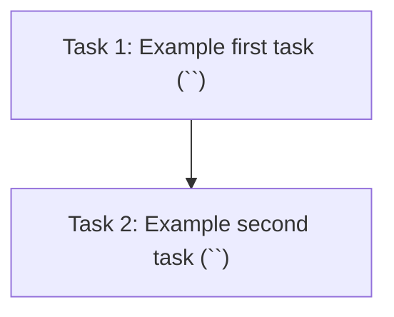

# Proposal Breakdown Template

Use this format when outputting task stubs from `pod-proposal-breakdown`.

The breakdown file is Markdown with YAML frontmatter. Task status tracking lives
only in frontmatter `tasks[]` and allowed values are `todo`, `executed`, and
`completed`.

## Task ID shape

The canonical `Task ID` value is reused everywhere a task is referenced.

- when a task has a linked tracker ticket:
  `Task ID = <full-ticket-key>-<suggested-slug>`
  (for example `<TICKET-KEY>-00-<short-task-slug>`)
- when no linked ticket exists yet:
  `Task ID = <suggested-slug>`
  (for example `00-<short-task-slug>`)
- the same value must appear in:
  - frontmatter `tasks[].id`
  - the section heading line `**Task ID:** <id>`
  - the intent-prompt line `**Task ID:** <id>`
- never produce a numeric-only ticket segment such as `187-...`; use the full
  tracker key exactly as linked

## Breakdown document id shape

The canonical breakdown document id is derived from the breakdown filename stem:

- `Breakdown ID = <proposal-stem>.breakdown.proposal`
- example: `<PROPOSAL-STEM>.breakdown.proposal`
- use this id in downstream spec metadata (`source_breakdown`)
- do not store lifecycle paths as the canonical breakdown reference

## Cross-task references

- prefer the exact `Task ID` and/or the exact task title for dependencies,
  gates, outcomes, and parallel-execution wording
- `Task N` ordinals are allowed only as a secondary positional aid inside the
  same breakdown document, and only when the same line or table cell still
  names the canonical `Task ID`

---

````markdown
---
tasks:
  - id: <task-id>
    status: todo
  - id: <task-id>
    status: todo
---

# Task Breakdown: {proposal-id}

**Source proposal:** `{proposal-path}`
**Total tasks:** N
**Chosen approach:** <One sentence from Technical Decisions>

---

## Task dependency graph



---

## Execution waves

<!-- Include this section only when the proposal defines execution waves. -->

| Wave | Tasks (run concurrently) | Gate before next wave |
| :--- | :------------------------- | :-------------------- |
| **Wave 1** | Task 1 (`<task-id-1>`), … | <gate text referencing `<task-id-1>` and any other canonical task ids> |
| **Wave 2** | Task N (`<task-id-N>`), … | <gate text referencing `<task-id-N>` and any other canonical task ids> |

---

## Task 1: <Name from proposal>

**Task ID:** `<task-id-1>` <!-- when ticketed: <full-ticket-key>-<suggested-slug>; otherwise: <suggested-slug> -->
**Ticket:** ~
**Depends on Ticket:** ~
**Branch name:** `<branch-name>` <!-- when Ticket is known: feat/<full-ticket-key>-<suggested-slug>; otherwise: feat/<suggested-slug> -->
**Depends on:** None
**Outcome:** <copied verbatim from proposal task Outcome line>
**Wave:** 1

<!-- Omit the Wave line when no execution waves section exists.
     Outcome stays directly after Depends on regardless of whether Wave is present. -->

**Spec id (when planned):** `YYYYMMDD-<suggested-slug>.spec` or
`YYYYMMDD-<ticket_number>-<suggested-slug>.spec`

**Anticipated file changes**

| Path | Type | Action | Summary |
| ---- | ---- | ------ | ------- |
| `src/module.ts` | module | create | Add core task module |
| `src/index.ts` | file | modify | Wire module into composition root |

**Intent prompt for pod-spec-create:**

> **Source:** Proposal `{proposal-id}` — `{proposal-path}`, Task 1 of N.
> **Source Breakdown:** `{breakdown-id}`
> **Suggested branch name:** `<branch-name>`
> **Suggested slug:** `01-<2-3-word-kebab-summary>`
> **Task ID:** `<task-id-1>`
> <2-4 sentence intent constrained by Technical Decisions and affected systems.>

**Key constraints from proposal:**
- <Constraint 1>
- <Constraint 2>

---

## Task 2: <Name from proposal>

**Task ID:** `<task-id-2>` <!-- when ticketed: <full-ticket-key>-<suggested-slug>; otherwise: <suggested-slug> -->
**Ticket:** ~
**Depends on Ticket:** ~
**Branch name:** `<branch-name>` <!-- when Ticket is known: feat/<full-ticket-key>-<suggested-slug>; otherwise: feat/<suggested-slug> -->
**Depends on:** `<task-id-1>` complete
**Outcome:** <copied verbatim from proposal task Outcome line>
**Wave:** 1

**Spec id (when planned):** `YYYYMMDD-<suggested-slug>.spec` or
`YYYYMMDD-<ticket_number>-<suggested-slug>.spec`

**Anticipated file changes**

| Path | Type | Action | Summary |
| ---- | ---- | ------ | ------- |
| `src/module-b.ts` | module | create | Add task-specific module |

**Intent prompt for pod-spec-create:**

> **Source:** Proposal `{proposal-id}` — `{proposal-path}`, Task 2 of N.
> **Source Breakdown:** `{breakdown-id}`
> **Suggested branch name:** `<branch-name>`
> **Suggested slug:** `02-<2-3-word-kebab-summary>`
> **Task ID:** `<task-id-2>`
> <2-4 sentence intent.>

**Key constraints from proposal:**
- <Constraint 1>

---

## Parallel execution summary

**Parallelizable groups:**
- `[<task-id-1>, <task-id-2>]` — safe to run in parallel.

**Accepted conflicts:** None

**Integration tasks:** None

---

## How to use these stubs

For each task, run `pod-spec-create` with the full intent prompt block. The
spec id is then generated from the `Suggested slug` using `pod-spec-id`, and
the same run provisions the spec-owned worktree using `Suggested branch name`
as `worktree_name`. When a task is linked to a tracker ticket, the suggested
branch name must use the full ticket key in the form
`feat/<full-ticket-key>-<suggested-slug>`.

Downstream spec metadata stores canonical ids only:

- `source_proposal` -> proposal id
- `source_breakdown` -> breakdown id (`{breakdown-id}`)
- `source_task_id` -> canonical task id

Current proposal or breakdown file paths may still appear in prose for operator
convenience, but they are not the canonical stored linkage values.

`**Outcome:**` is sourced verbatim from the proposal task's `Outcome` line and
must not be paraphrased. If the source proposal lacks an `Outcome` line
(legacy proposal), copy the task `Intent` verbatim into `**Outcome:**` and
record a follow-up open question noting the missing Outcome so the proposal
can be backfilled on its next material revision.

```
pod-spec-create: <paste full task intent prompt>
```

### Parallel spec-create (subagents)

Copy-paste prompt for the orchestrator agent:

```
Spawn subagents to run pod-spec-create for each task in @{breakdown-path}
```

Respect `Depends on` plus `Parallel execution summary` when choosing concurrent
work.

### Parallel spec-create by wave (subagents)

<!-- Include this subsection only when Execution waves exists. -->

**Copy-paste prompt — Wave 1**

```
Spawn subagents to spec-create only Wave 1 tasks in @{breakdown-path} — Task IDs: `<task-id-1>`, `<task-id-2>`. Gate before Wave 2: <gate text using canonical task ids>.
```

**Copy-paste prompt — Wave 2**

```
Spawn subagents to spec-create only Wave 2 tasks in @{breakdown-path} — Task IDs: `<task-id-3>`, `<task-id-4>`. Gate before Wave 3: <gate text using canonical task ids, or "n/a">.
```

**Ticket preparation (optional):** if tracker integration is enabled, run
`pod-project-management-tracker` operation `prepare` for this breakdown file to
populate `**Ticket:**` and `**Depends on Ticket:**`. After ticket preparation,
re-derive each affected `Task ID` to its ticket-aware shape
(`<full-ticket-key>-<suggested-slug>`) and update frontmatter `tasks[].id`,
the section `**Task ID:**` line, and the intent-prompt `**Task ID:**` line in
the same run so all three stay aligned.

**Task status lifecycle:** `todo -> executed -> completed`, updated by downstream
spec execution and completion flows using `Task ID` matching.
````
