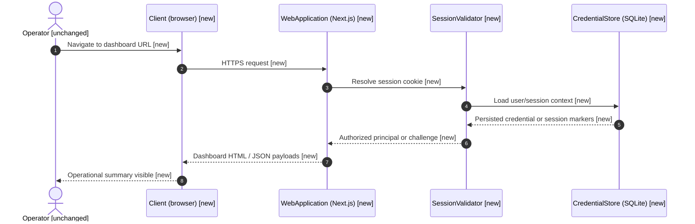
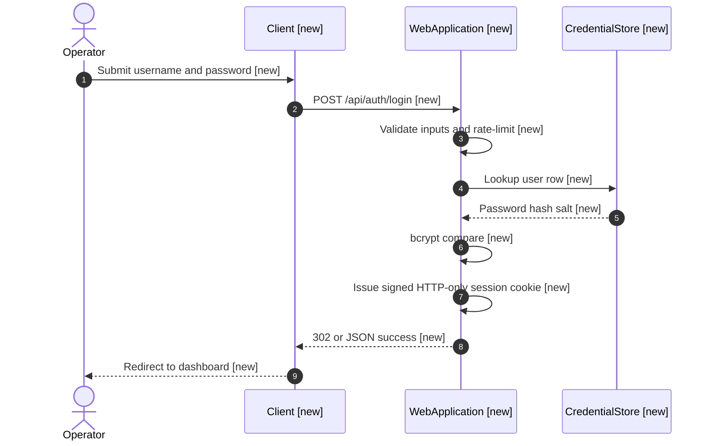
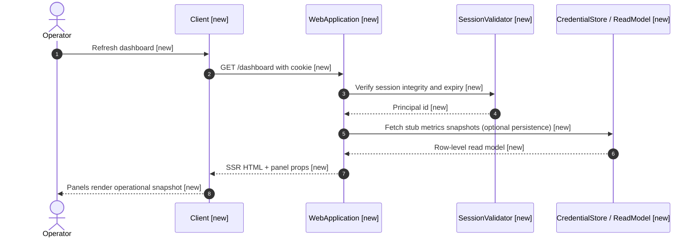
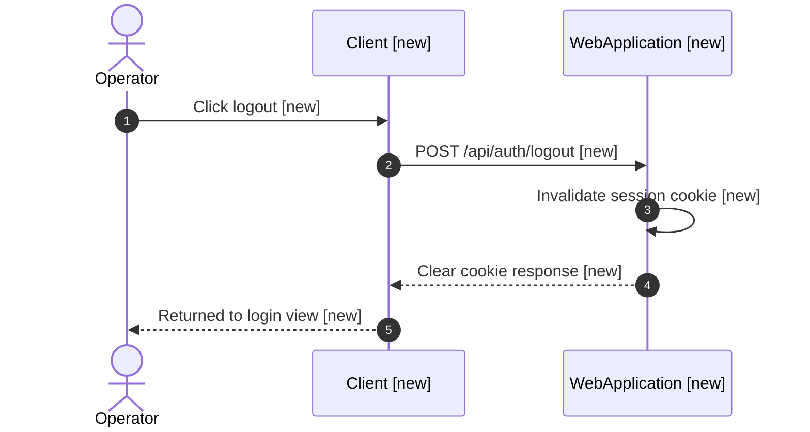

# Proposal: Simple ops dashboard web app with session login

> Deliver a minimal, deployable web experience where operators sign in once and view a read-oriented dashboard for day-to-day operational signals, implemented as a first-class app in the `test` GitHub project.

## Problem Statement

### Current Behavior

- There is no dedicated operator-facing web surface in scope for consolidated health, version, and queue-style signals.
- `projects/test/docs/` architecture context is not yet present in this workspace, so stack-level conventions for web apps and auth must be established alongside implementation.

### Desired Behavior

- Operators open a browser URL, authenticate with a password-based login, and land on a compact dashboard with clearly separated panels (for example: application version or build id, synthetic health check, and placeholder metrics that can later bind to real backends).
- Sessions use server-side validation on each navigation and API read so refresh and direct URL access behave predictably.
- The solution remains small enough to ship inside the existing `test` repository without introducing a large distributed system.

## Non-Functional Requirements

| Dimension | Target | Notes |
| :-------- | :----- | :---- |
| **Latency (p99)** | Under 500 ms for dashboard HTML on warm instance | Excludes first cold start on serverless |
| **Throughput** | Tens of concurrent operators | Not a public consumer surface |
| **Availability / SLA** | Best-effort internal tool | Document maintenance windows |
| **Data sensitivity** | Low (ops metadata, no end-user PII in v1) | Still protect credentials at rest |
| **Auth model** | Password + server session (HTTP-only cookie) | Multi-user via hashed credentials store |
| **Regulatory / compliance** | None assumed | Revisit if tenant data appears on dashboard |

## Architecture Impact

**Status:** requires updates to one or more project context docs

**Summary:** This proposal introduces a new web surface and auth boundary in the `test` project. Workspace configuration already lists the project in `workspace.yaml`, but project-level Architecture-as-Code files are absent; they should be added when implementation starts so future proposals can cite `projects/test/docs/architecture.md` and related indexes.

**Context updates required:** `projects/test/docs/architecture.md`, `projects/test/docs/_context-map.yaml` (and optional `_page-map.yaml` once routes exist)

**Drift or open questions:** Verified primary worktree was not deep-inspected for this draft because project docs are missing; initial stack choice should be reconciled with whatever already exists in `https://github.com/harshith-podifi/test` during implementation.

## Out of Scope

- Fine-grained RBAC, SSO/OIDC, and multi-tenant administration flows (defer to a later proposal if SSO becomes mandatory).
- Mutating operational actions from the dashboard (restart services, toggle feature flags); v1 is read-only except auth actions.
- Mobile-native apps and push notifications.

## Solution

### Approach - Next.js app with credential login and SQLite-backed accounts

**Proposed Solution:** Implement a compact **Next.js (App Router)** application colocated in the `test` repository with **credentials-based login**, **HTTP-only cookie sessions** (signed using a server secret), and **SQLite** (via Prisma or Drizzle) for a small `ops_users` table storing bcrypt password hashes. Dashboard pages fetch read models through **Next.js Route Handlers** so secrets never reach the browser. Panels start with stubbed JSON payloads shaped like future real probes (Kubernetes, queues, uptime checks) without wiring those integrations in v1.

**Architecture Flow:**

```text
Browser -> Next.js (UI routes + Route Handlers) -> Session middleware -> SQLite (users + optional cached metrics snapshots)
Browser -> External health/version endpoints only when explicitly integrated later (optional path)
```

**Sequence Diagrams:**

Status legend:

- `[existing]` - boundary reused as-is
- `[new]` - introduced by this proposal
- `[changed]` - behavior changes
- `[refactor]` - reorganized without intended behavior change
- `[delete]` - planned removal; omitted from diagrams unless migration flow

Overall data flow across the affected boundaries:



Per-feature flows:

_Login_



_Authenticated dashboard read_



_Logout_



**Implementation:**

- **Routing / UI:** App Router layouts for `/login` and `/dashboard`; minimal component library or plain CSS modules to avoid heavy dependencies.
- **Auth:** Shared server helper for bcrypt verification, constant-time comparisons, brute-force backoff (simple per-IP counter in memory for v1, document upgrade path to Redis).
- **Data:** SQLite file under a configurable path (`OPS_DB_PATH`), migration on deploy; bootstrap script or env-driven initial admin password hash for first run.
- **Observability:** Structured logs around auth success or failure without logging secrets; expose `/api/health` for process probes.

**Pros:**

- One repository, one deployable artifact suitable for Docker or platform PaaS.
- Clear upgrade path toward external IdP later by swapping the auth helper.
- SQLite keeps local development lightweight.

**Cons:**

- SQLite is weaker for horizontally scaled multi-instance setups unless read-only replicas or external DB is adopted later.
- Next.js footprint is heavier than raw static HTML; acceptable for richer auth and SSR.

**Security & Operability:**

- Security: bcrypt cost factor configurable; rotate `SESSION_SECRET` via secrets manager; HTTPS termination required in production.
- Performance: SSR dashboard should batch panel queries to avoid sequential waterfalls.
- Deployment / rollback: container image versioning tied to CI build id shown in dashboard panel.
- Observability: log auth anomalies; dashboard displays build id loaded from env `GIT_SHA` or CI inject.

**Effort:** Medium

## Trade-off Summary

| Dimension | Assessment |
| :-------- | :--------- |
| **Security impact** | Medium — introduces credential storage; mitigated via bcrypt and HTTP-only cookies |
| **Performance (latency / throughput)** | Medium — SSR per request; caching optional later |
| **Observability / monitoring** | Low-Medium — add auth metrics and synthetic panel timestamps |
| **Deployment complexity** | Medium — Node runtime + SQLite volume or mounted file |
| **Rollback strategy** | Revert container tag; database migrations reversible if additive-only |
| **Failure mode** | Invalid session redirects to login; DB outage blocks auth (dashboard becomes unavailable) |
| **Implementation effort** | Medium single-service effort |
| **Operational complexity** | Low after initial bootstrap |
| **Estimated cost** | Low for small team usage |

## Technical Decisions

### Why Next.js with SQLite instead of separate SPA + standalone API?

- Chosen because one codebase reduces auth edge cases between static hosting and APIs, SSR simplifies protecting routes, and Route Handlers keep secrets centralized.
- A decoupled React SPA served from object storage plus a FastAPI backend was rejected for v1 because CORS, cookie domains, and dual deploy pipelines add friction for a deliberately small dashboard.

## Affected Systems

| System / Component | How affected |
| :----------------- | :----------- |
| `test` GitHub repository | New web app subtree, CI pipeline updates, Dockerfile or platform manifest |
| Operator browsers | New bookmarkable URL |
| SQLite datastore | New file or volume for hashed credentials |

## Task Breakdown

1. **Task 1: Repository scaffold and tooling**  
   Assign: Repo owner (`test`) / full-stack engineer  
   Intent: Add Next.js baseline (TypeScript, lint, format), Dockerfile or deployment manifest, CI job for typecheck/build, environment variable contracts (`SESSION_SECRET`, `OPS_DB_PATH`, `GIT_SHA`).  
   Outcome: Fresh clone installs dependencies and produces a runnable dev server documented in README.  
   Dependencies: None

2. **Task 2: Credential model and migrations**  
   Assign: Backend-focused engineer  
   Intent: Define `ops_users` schema, hashed password column, migrations, programmatic seed path for bootstrap admin credentials.  
   Outcome: Local SQLite holds at least one user row and survives migration replay from clean state.  
   Dependencies: Task 1

3. **Task 3: Authentication routes and middleware**  
   Assign: Backend / security-minded engineer  
   Intent: Implement login POST handler, bcrypt verification, cookie issuance, guarded layout for `/dashboard`, logout clearing cookie, coarse rate limiting.  
   Outcome: Valid credentials yield a dashboard view; invalid credentials stay on login without leaking which field failed beyond generic error.  
   Dependencies: Task 2

4. **Task 4: Dashboard UX and stub panels**  
   Assign: Frontend engineer  
   Intent: Compose dashboard layout panels for version/build id, service health stub, workload queue depth stub wired to mocked Route Handlers.  
   Outcome: Logged-in operator sees three coherent panels sourced from authenticated JSON endpoints with loading and error placeholders.  
   Dependencies: Task 3

5. **Task 5: Hardening and documentation pass**  
   Assign: Senior engineer  
   Intent: HTTPS-only guidance, CSP headers, secrets rotation notes, README operator instructions, drafting `projects/test/docs/architecture.md` describing the web layer.  
   Outcome: Project docs exist alongside working production checklist and security README section reviewers can approve.  
   Dependencies: Task 4

### Task Breakdown Summary

#### Dependency graph

```text
Task 1 -> Task 2 -> Task 3 -> Task 4 -> Task 5
```

#### Parallel execution waves

| Wave | Tasks | Gate before next wave |
| :--- | :---- | :-------------------- |
| **Wave 1** | Task 1 | Scaffold builds cleanly |
| **Wave 2** | Task 2 | Schema migrated |
| **Wave 3** | Task 3 | Sessions enforce auth |
| **Wave 4** | Task 4 | Panels render stubs |
| **Wave 5** | Task 5 | Docs merged |

#### Critical path

`Task 1 -> Task 2 -> Task 3 -> Task 4 -> Task 5`

#### Rationale

- **Task 1** - Establishes the delivery vehicle before schema or UX work piles on.
- **Task 3** depends on persisted users — cannot validate sessions earlier.
- **Task 5** deliberately last so documentation captures the actual routes and threats implemented.

## Open Questions / Risks

- [ ] Hosting target (bare VM vs container orchestrator vs managed PaaS) — **Owner:** Platform — **Assumption:** container with attached volume for SQLite is acceptable initially.
- [ ] Whether OIDC mandate appears before launch — **Owner:** Security — **Assumption:** password auth-only for v1.
- [ ] Existing code in `test` may constrain framework choice — **Owner:** Maintainer — **Assumption:** greenfield subdirectory is allowed; refactor if forbidden.

## References

- `workspace.yaml`

## Glossary

| Term | Definition |
| :--- | :--------- |
| Route Handler | Next.js server function implementing HTTP APIs without exposing secrets client-side |
| Ops user | Internal human operator consuming the dashboard |
