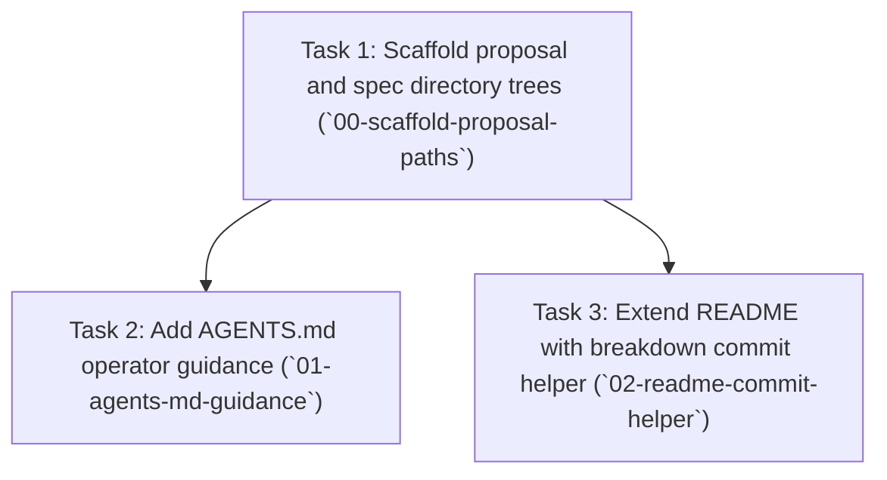

---
tasks:
  - id: 00-scaffold-proposal-paths
    status: todo
  - id: 01-agents-md-guidance
    status: todo
  - id: 02-readme-commit-helper
    status: todo
---

# Task Breakdown: 20260514-agentice-proposal-workflow.proposal

**Source proposal:** `proposals/inprogress/20260514-agentice-proposal-workflow.proposal.md`
**Total tasks:** 3
**Chosen approach:** Use in-repository directories aligned with `workspace.yaml` instead of an external wiki so Pod tooling path validation stays authoritative.

---

## Task dependency graph



---

## Execution waves

| Wave | Tasks (run concurrently) | Gate before next wave |
| :--- | :------------------------- | :-------------------- |
| **Wave 1** | Task 1 (`00-scaffold-proposal-paths`) | Task 1 complete — all configured proposal and spec directories exist with README stubs. |
| **Wave 2** | Task 2 (`01-agents-md-guidance`), Task 3 (`02-readme-commit-helper`) | All tasks complete — specs created and integrated downstream via `pod-spec-create` when ready. |

---

## Task 1: Scaffold proposal and spec directory trees

**Task ID:** `00-scaffold-proposal-paths`
**Ticket:** ~
**Depends on Ticket:** ~
**Branch name:** `feat/00-scaffold-proposal-paths`
**Depends on:** None
**Outcome:** Every path declared under `proposal.*_path` and `spec.*_path` in `workspace.yaml` exists and contains a README describing its lifecycle role.
**Wave:** 1

**Spec id (when planned):** `20260514-00-scaffold-proposal-paths.spec`

**Anticipated file changes**

| Path | Type | Action | Summary |
| ---- | ---- | ------ | ------- |
| `proposals/backlog/README.md` | doc | create | Describe backlog stage for proposals |
| `proposals/inprogress/README.md` | doc | create | Describe in-progress proposals |
| `proposals/completed/README.md` | doc | create | Describe completed proposals archive |
| `specs/backlog/README.md` | doc | create | Describe backlog specs |
| `specs/inprogress/README.md` | doc | create | Describe active specs |
| `specs/completed/README.md` | doc | create | Describe completed specs |

**Intent prompt for pod-spec-create:**

> **Source:** Proposal `20260514-agentice-proposal-workflow.proposal` — `proposals/inprogress/20260514-agentice-proposal-workflow.proposal.md`, Task 1 of 3.
> **Source Breakdown:** `20260514-agentice-proposal-workflow.breakdown.proposal`
> **Suggested branch name:** `feat/00-scaffold-proposal-paths`
> **Suggested slug:** `00-scaffold-proposal-paths`
> **Task ID:** `00-scaffold-proposal-paths`
> Create the six lifecycle directories declared in `workspace.yaml` (`proposals/backlog|inprogress|completed`, `specs/backlog|inprogress|completed`) and add a concise README to each explaining how artifacts move between stages. Keep content generic so it stays valid as tooling evolves.

**Key constraints from proposal:**
- Paths must match `workspace.yaml` roots exactly (no alternate layouts).
- Editorial/documentation scope only — no changes inside `projects/test/test__primary_worktree`.

---

## Task 2: Add AGENTS.md operator guidance

**Task ID:** `01-agents-md-guidance`
**Ticket:** ~
**Depends on Ticket:** ~
**Branch name:** `feat/01-agents-md-guidance`
**Depends on:** `00-scaffold-proposal-paths` complete
**Outcome:** `AGENTS.md` exists at the repository root and enumerates the primary Pod proposal/spec commands with paths grounded in `workspace.yaml`.
**Wave:** 2

**Spec id (when planned):** `20260514-01-agents-md-guidance.spec`

**Anticipated file changes**

| Path | Type | Action | Summary |
| ---- | ---- | ------ | ------- |
| `AGENTS.md` | doc | create | Operator/agent checklist for proposal and spec lifecycle |

**Intent prompt for pod-spec-create:**

> **Source:** Proposal `20260514-agentice-proposal-workflow.proposal` — `proposals/inprogress/20260514-agentice-proposal-workflow.proposal.md`, Task 2 of 3.
> **Source Breakdown:** `20260514-agentice-proposal-workflow.breakdown.proposal`
> **Suggested branch name:** `feat/01-agents-md-guidance`
> **Suggested slug:** `01-agents-md-guidance`
> **Task ID:** `01-agents-md-guidance`
> Author `AGENTS.md` summarizing how to approve/update proposals, generate breakdowns, commit breakdown artifacts, and create specs using Pod CLI entrypoints referenced under `.claude/commands/`. Tie every directory mention to values from `workspace.yaml`.

**Key constraints from proposal:**
- Documentation-only; no runtime code.
- Commands must reference concrete configured proposal/spec roots.

---

## Task 3: Extend README with breakdown commit helper

**Task ID:** `02-readme-commit-helper`
**Ticket:** ~
**Depends on Ticket:** ~
**Branch name:** `feat/02-readme-commit-helper`
**Depends on:** `00-scaffold-proposal-paths` complete
**Outcome:** Root `README.md` mentions proposal directories and documents invoking `.claude/commands/pod-proposal-file-commit/run.sh` on breakdown files under configured proposal roots.
**Wave:** 2

**Spec id (when planned):** `20260514-02-readme-commit-helper.spec`

**Anticipated file changes**

| Path | Type | Action | Summary |
| ---- | ---- | ------ | ------- |
| `README.md` | doc | modify | Link lifecycle dirs and document breakdown commit helper |

**Intent prompt for pod-spec-create:**

> **Source:** Proposal `20260514-agentice-proposal-workflow.proposal` — `proposals/inprogress/20260514-agentice-proposal-workflow.proposal.md`, Task 3 of 3.
> **Source Breakdown:** `20260514-agentice-proposal-workflow.breakdown.proposal`
> **Suggested branch name:** `feat/02-readme-commit-helper`
> **Suggested slug:** `02-readme-commit-helper`
> **Task ID:** `02-readme-commit-helper`
> Expand `README.md` so newcomers see where proposals live and how to run `pod-proposal-file-commit` after generating `*.breakdown.proposal.md` files. Mention that the helper validates paths against `workspace.yaml` and only stages the breakdown file.

**Key constraints from proposal:**
- Must surface `.claude/commands/pod-proposal-file-commit/run.sh` explicitly.
- Stay aligned with directory layout from Task `00-scaffold-proposal-paths`.

---

## Parallel execution summary

**Parallelizable groups:**
- `[01-agents-md-guidance, 02-readme-commit-helper]` — safe to run in parallel after `00-scaffold-proposal-paths`; no overlapping modified files (`AGENTS.md` vs `README.md`).

**Accepted conflicts:** None

**Integration tasks:** None

---

## How to use these stubs

For each task, run `pod-spec-create` with the full intent prompt block. The
spec id is then generated from the `Suggested slug` using `pod-spec-id`, and
the same run provisions the spec-owned worktree using `Suggested branch name`
as `worktree_name`. When a task is linked to a tracker ticket, the suggested
branch name must use the full ticket key in the form
`feat/<full-ticket-key>-<suggested-slug>`.

Downstream spec metadata stores canonical ids only:

- `source_proposal` -> proposal id
- `source_breakdown` -> breakdown id (`20260514-agentice-proposal-workflow.breakdown.proposal`)
- `source_task_id` -> canonical task id

Current proposal or breakdown file paths may still appear in prose for operator
convenience, but they are not the canonical stored linkage values.

`**Outcome:**` is sourced verbatim from the proposal task's `Outcome` line and
must not be paraphrased. If the source proposal lacks an `Outcome` line
(legacy proposal), copy the task `Intent` verbatim into `**Outcome:**` and
record a follow-up open question noting the missing Outcome so the proposal
can be backfilled on its next material revision.

```
pod-spec-create: <paste full task intent prompt>
```

### Parallel spec-create (subagents)

Copy-paste prompt for the orchestrator agent:

```
Spawn subagents to run pod-spec-create for each task in @proposals/inprogress/20260514-agentice-proposal-workflow.breakdown.proposal.md
```

Respect `Depends on` plus `Parallel execution summary` when choosing concurrent
work.

### Parallel spec-create by wave (subagents)

**Copy-paste prompt — Wave 1**

```
Spawn subagents to spec-create only Wave 1 tasks in @proposals/inprogress/20260514-agentice-proposal-workflow.breakdown.proposal.md — Task IDs: `00-scaffold-proposal-paths`. Gate before Wave 2: Task 1 complete — all configured proposal and spec directories exist with README stubs.
```

**Copy-paste prompt — Wave 2**

```
Spawn subagents to spec-create only Wave 2 tasks in @proposals/inprogress/20260514-agentice-proposal-workflow.breakdown.proposal.md — Task IDs: `01-agents-md-guidance`, `02-readme-commit-helper`. Gate before Wave 3: n/a (final wave).
```

**Ticket preparation (optional):** if tracker integration is enabled, run
`pod-project-management-tracker` operation `prepare` for this breakdown file to
populate `**Ticket:**` and `**Depends on Ticket:**`. After ticket preparation,
re-derive each affected `Task ID` to its ticket-aware shape
(`<full-ticket-key>-<suggested-slug>`) and update frontmatter `tasks[].id`,
the section `**Task ID:**` line, and the intent-prompt `**Task ID:**` line in
the same run so all three stay aligned.

**Task status lifecycle:** `todo -> executed -> completed`, updated by downstream
spec execution and completion flows using `Task ID` matching.
