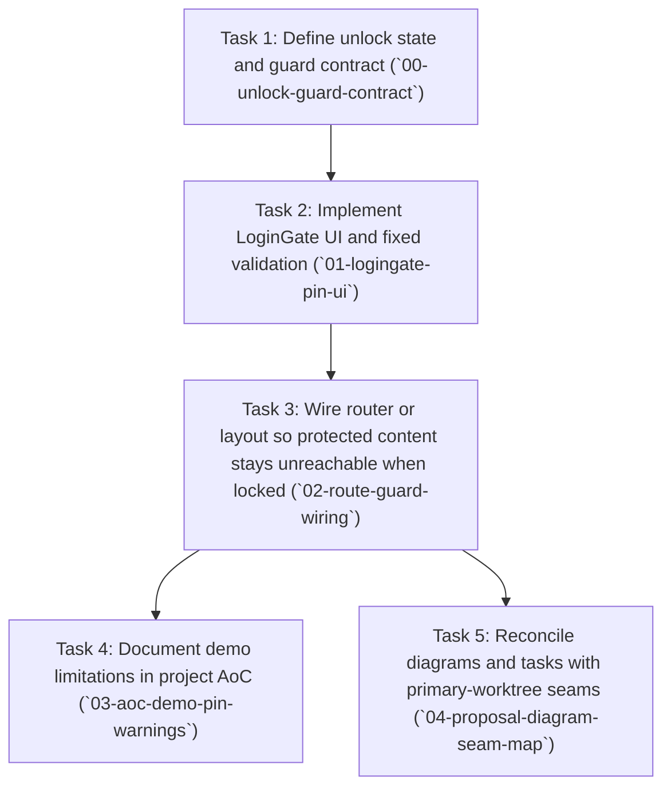

---
tasks:
  - id: 00-unlock-guard-contract
    status: todo
  - id: 01-logingate-pin-ui
    status: todo
  - id: 02-route-guard-wiring
    status: todo
  - id: 03-aoc-demo-pin-warnings
    status: todo
  - id: 04-proposal-diagram-seam-map
    status: todo
---

# Task Breakdown: 20260514-dummy-fixed-code-login.proposal

**Source proposal:** `proposals/inprogress/20260514-dummy-fixed-code-login.proposal.md`  
**Total tasks:** 5  
**Chosen approach:** Use a client-side fixed PIN (`1234`), a lightweight unlock flag (in-memory or `sessionStorage`), and a single route/layout guard so every protected surface consults the same check—no backend auth for the baseline.

---

## Task dependency graph



---

## Execution waves

| Wave | Tasks (run concurrently) | Gate before next wave |
| :--- | :------------------------- | :-------------------- |
| **Wave 1** | Task 1 (`00-unlock-guard-contract`) | Unlock model agreed: `00-unlock-guard-contract` complete |
| **Wave 2** | Task 2 (`01-logingate-pin-ui`) | UI and validation compile: `01-logingate-pin-ui` complete |
| **Wave 3** | Task 3 (`02-route-guard-wiring`) | Routing verified manually: `02-route-guard-wiring` complete |
| **Wave 4** | Task 4 (`03-aoc-demo-pin-warnings`), Task 5 (`04-proposal-diagram-seam-map`) | AoC seeded and diagram reconciliation captured: `03-aoc-demo-pin-warnings` and `04-proposal-diagram-seam-map` complete |

---

## Task 1: Define unlock state and guard contract

**Task ID:** `00-unlock-guard-contract`  
**Ticket:** ~  
**Depends on Ticket:** ~  
**Branch name:** `feat/00-unlock-guard-contract`  
**Depends on:** None  
**Outcome:** Reviewers can trace every protected entry point to the same unlock check without ambiguity.  
**Wave:** 1  

**Spec id (when planned):** `20260514-00-unlock-guard-contract.spec`

**Anticipated file changes**

| Path | Type | Action | Summary |
| ---- | ---- | ------ | ------- |
| `projects/test/test__primary_worktree/docs/demo-access/unlock-guard-contract.md` | doc | create | Written contract: unlock representation, persistence choice, protected route list |
| `projects/test/test__primary_worktree/src/lib/demo-access/unlock-model.ts` | module | create | Types/helpers for unlock flag (exact path may shift with scaffold; single owner for unlock API) |

**Intent prompt for pod-spec-create:**

> **Source:** Proposal `20260514-dummy-fixed-code-login.proposal` — `proposals/inprogress/20260514-dummy-fixed-code-login.proposal.md`, Task 1 of 5.  
> **Source Breakdown:** `20260514-dummy-fixed-code-login.breakdown.proposal`  
> **Suggested branch name:** `feat/00-unlock-guard-contract`  
> **Suggested slug:** `00-unlock-guard-contract`  
> **Task ID:** `00-unlock-guard-contract`  
> Specify how the “unlocked” demo flag is represented (in-memory vs `sessionStorage` per proposal assumptions), which routes or layouts are protected, and how every entry point will call the same guard check before rendering protected UI. Stay client-only; do not introduce real auth or configurable secrets.

**Key constraints from proposal:**

- Dummy gate only—document that this is non-production.
- Single shared guard contract consumed by all protected surfaces; no duplicate ad hoc checks.

---

## Task 2: Implement LoginGate UI and fixed validation

**Task ID:** `01-logingate-pin-ui`  
**Ticket:** ~  
**Depends on Ticket:** ~  
**Branch name:** `feat/01-logingate-pin-ui`  
**Depends on:** `00-unlock-guard-contract` complete  
**Outcome:** Entering `1234` sets unlocked state; any other input shows an error and leaves the user on the gate.  
**Wave:** 2  

**Spec id (when planned):** `20260514-01-logingate-pin-ui.spec`

**Anticipated file changes**

| Path | Type | Action | Summary |
| ---- | ---- | ------ | ------- |
| `projects/test/test__primary_worktree/src/lib/demo-access/demo-pin.ts` | module | create | Central `1234` constant with demo-only warning comment |
| `projects/test/test__primary_worktree/src/components/DemoLoginGate.tsx` | component | create | Single-field code UI, trim/normalize per assumptions, sets unlock on match |

**Intent prompt for pod-spec-create:**

> **Source:** Proposal `20260514-dummy-fixed-code-login.proposal` — `proposals/inprogress/20260514-dummy-fixed-code-login.proposal.md`, Task 2 of 5.  
> **Source Breakdown:** `20260514-dummy-fixed-code-login.breakdown.proposal`  
> **Suggested branch name:** `feat/01-logingate-pin-ui`  
> **Suggested slug:** `01-logingate-pin-ui`  
> **Task ID:** `01-logingate-pin-ui`  
> Implement the LoginGate surface: one code field, submit path, compare to centralized `1234`, clear inline error on mismatch, no navigation forward on failure. Wire success to the unlock model from `00-unlock-guard-contract`. Keep UX accessible; no username or backend calls.

**Key constraints from proposal:**

- Validate against fixed `1234` only; no env-driven PIN for this flow.
- Wrong code must not set unlocked state or expose protected chrome.

---

## Task 3: Wire router or layout so protected content stays unreachable when locked

**Task ID:** `02-route-guard-wiring`  
**Ticket:** ~  
**Depends on Ticket:** ~  
**Branch name:** `feat/02-route-guard-wiring`  
**Depends on:** `01-logingate-pin-ui` complete  
**Outcome:** Manual navigation tests confirm no forward progress to main app until the valid code is entered.  
**Wave:** 3  

**Spec id (when planned):** `20260514-02-route-guard-wiring.spec`

**Anticipated file changes**

| Path | Type | Action | Summary |
| ---- | ---- | ------ | ------- |
| `projects/test/test__primary_worktree/src/app/router.tsx` | module | create | Route table or lazy routes integrating guard (exact filename per scaffold) |
| `projects/test/test__primary_worktree/src/app/layout.tsx` | layout | modify | App shell wiring: guard resolves to LoginGate while locked |
| `projects/test/test__primary_worktree/src/app/ProtectedLayout.tsx` | layout | create | Optional wrapper that enforces unlock before children render |

**Intent prompt for pod-spec-create:**

> **Source:** Proposal `20260514-dummy-fixed-code-login.proposal` — `proposals/inprogress/20260514-dummy-fixed-code-login.proposal.md`, Task 3 of 5.  
> **Source Breakdown:** `20260514-dummy-fixed-code-login.breakdown.proposal`  
> **Suggested branch name:** `feat/02-route-guard-wiring`  
> **Suggested slug:** `02-route-guard-wiring`  
> **Task ID:** `02-route-guard-wiring`  
> Ensure deep links and default routes cannot render protected content until unlocked: guard at router or root layout, redirect/replace with LoginGate while locked, preserve proposal’s interaction verification mapping (wrong code, right code, deep link while locked).

**Key constraints from proposal:**

- All protected routes must consult the same unlock signal defined in Task 1.
- **Accepted conflict:** root layout/router files may be modified here after LoginGate exists in Task 2—sequence enforced by dependencies.

---

## Task 4: Document demo limitations in project AoC

**Task ID:** `03-aoc-demo-pin-warnings`  
**Ticket:** ~  
**Depends on Ticket:** ~  
**Branch name:** `feat/03-aoc-demo-pin-warnings`  
**Depends on:** `02-route-guard-wiring` complete  
**Outcome:** New contributors see that `1234` is intentional demo behavior, not security.  
**Wave:** 4  

**Spec id (when planned):** `20260514-03-aoc-demo-pin-warnings.spec`

**Anticipated file changes**

| Path | Type | Action | Summary |
| ---- | ---- | ------ | ------- |
| `projects/test/docs/architecture.md` | doc | create | Describe demo access gate, unlock mechanism, explicit non-production warning |
| `projects/test/docs/pattern.md` | doc | create | Pattern: dummy PIN, guard usage, when to replace with real auth |

**Intent prompt for pod-spec-create:**

> **Source:** Proposal `20260514-dummy-fixed-code-login.proposal` — `proposals/inprogress/20260514-dummy-fixed-code-login.proposal.md`, Task 4 of 5.  
> **Source Breakdown:** `20260514-dummy-fixed-code-login.breakdown.proposal`  
> **Suggested branch name:** `feat/03-aoc-demo-pin-warnings`  
> **Suggested slug:** `03-aoc-demo-pin-warnings`  
> **Task ID:** `03-aoc-demo-pin-warnings`  
> Create or seed `projects/test/docs/architecture.md` and `pattern.md` under the Pod workspace describing the demo gate, fixed PIN, unlock flag semantics, and clear warnings not to treat `1234` as production security. Align wording with the approved proposal’s Architecture Impact.

**Key constraints from proposal:**

- AoC must flag dummy credential and lack of real authentication.
- Files live in workspace `projects/test/docs/`, not inside the ignored primary worktree checkout.

---

## Task 5: Reconcile diagrams and tasks with primary-worktree seams

**Task ID:** `04-proposal-diagram-seam-map`  
**Ticket:** ~  
**Depends on Ticket:** ~  
**Branch name:** `feat/04-proposal-diagram-seam-map`  
**Depends on:** `02-route-guard-wiring` complete  
**Outcome:** A short mapping table (or inline bullets) ties LoginGate, guard, unlock store, and router shell to concrete repo locations; diagram `[new]`/`[changed]` labels are updated if any boundary reuses existing code.  
**Wave:** 4  

**Spec id (when planned):** `20260514-04-proposal-diagram-seam-map.spec`

**Anticipated file changes**

| Path | Type | Action | Summary |
| ---- | ---- | ------ | ------- |
| `projects/test/test__primary_worktree/docs/demo-access/diagram-seam-map.md` | doc | create | Table mapping each sequence participant to path/module/route |
| `proposals/inprogress/20260514-dummy-fixed-code-login.proposal.md` | proposal | modify | Optional: refresh diagram status labels and drift note after reconciliation |

**Intent prompt for pod-spec-create:**

> **Source:** Proposal `20260514-dummy-fixed-code-login.proposal` — `proposals/inprogress/20260514-dummy-fixed-code-login.proposal.md`, Task 5 of 5.  
> **Source Breakdown:** `20260514-dummy-fixed-code-login.breakdown.proposal`  
> **Suggested branch name:** `feat/04-proposal-diagram-seam-map`  
> **Suggested slug:** `04-proposal-diagram-seam-map`  
> **Task ID:** `04-proposal-diagram-seam-map`  
> After Tasks `01-logingate-pin-ui` and `02-route-guard-wiring` land, document a seam map from the proposal’s sequence diagrams (LoginGate, unlock store, guard, router, app shell) to concrete files and routes in `projects/test/test__primary_worktree`. If any boundary reuses existing code, update the source proposal’s Mermaid labels accordingly via `pod-proposal-update`; otherwise confirm all remain `[new]`.

**Key constraints from proposal:**

- Keep mapping honest vs verified primary worktree; record drift instead of guessing.
- Preserve canonical proposal id when editing diagram metadata.

---

## Parallel execution summary

**Parallelizable groups:**

- `[03-aoc-demo-pin-warnings, 04-proposal-diagram-seam-map]` — safe in parallel once `02-route-guard-wiring` is complete (disjoint primary paths: workspace AoC docs vs seam-map doc / optional proposal edit).

**Accepted conflicts:**

- Root layout / router shell files (`02-route-guard-wiring`) may overlap conceptually with LoginGate integration from `01-logingate-pin-ui`; mitigated by strict dependency order (02 after `01-logingate-pin-ui`).

**Integration tasks:**

- `02-route-guard-wiring` integrates unlock model + LoginGate into navigable app behavior.

---

## How to use these stubs

For each task, run `pod-spec-create` with the full intent prompt block. The spec id is then generated from the `Suggested slug` using `pod-spec-id`, and the same run provisions the spec-owned worktree using `Suggested branch name` as `worktree_name`. When a task is linked to a tracker ticket, the suggested branch name must use the full ticket key in the form `feat/<full-ticket-key>-<suggested-slug>`.

Downstream spec metadata stores canonical ids only:

- `source_proposal` → proposal id  
- `source_breakdown` → breakdown id (`20260514-dummy-fixed-code-login.breakdown.proposal`)  
- `source_task_id` → canonical task id  

Current proposal or breakdown file paths may still appear in prose for operator convenience, but they are not the canonical stored linkage values.

`**Outcome:**` is sourced verbatim from the proposal task's `Outcome` line and must not be paraphrased.

```
pod-spec-create: <paste full task intent prompt>
```

### Parallel spec-create (subagents)

Copy-paste prompt for the orchestrator agent:

```
Spawn subagents to run pod-spec-create for proposals/inprogress/20260514-dummy-fixed-code-login.breakdown.proposal.md in dependency order; parallelize Wave 4 only after `02-route-guard-wiring` is done.
```

### Parallel spec-create by wave (subagents)

**Copy-paste prompt — Wave 1**

```
Spawn subagents to spec-create only Wave 1 tasks in proposals/inprogress/20260514-dummy-fixed-code-login.breakdown.proposal.md — Task IDs: `00-unlock-guard-contract`. Gate before Wave 2: `00-unlock-guard-contract` complete.
```

**Copy-paste prompt — Wave 2**

```
Spawn subagents to spec-create only Wave 2 tasks in proposals/inprogress/20260514-dummy-fixed-code-login.breakdown.proposal.md — Task IDs: `01-logingate-pin-ui`. Gate before Wave 3: `01-logingate-pin-ui` complete.
```

**Copy-paste prompt — Wave 3**

```
Spawn subagents to spec-create only Wave 3 tasks in proposals/inprogress/20260514-dummy-fixed-code-login.breakdown.proposal.md — Task IDs: `02-route-guard-wiring`. Gate before Wave 4: `02-route-guard-wiring` complete.
```

**Copy-paste prompt — Wave 4**

```
Spawn subagents to spec-create only Wave 4 tasks in proposals/inprogress/20260514-dummy-fixed-code-login.breakdown.proposal.md — Task IDs: `03-aoc-demo-pin-warnings`, `04-proposal-diagram-seam-map`. Gate: both complete before downstream implementation waves.
```

**Ticket preparation (optional):** if tracker integration is enabled, run `pod-project-management-tracker` operation `prepare` for this breakdown file to populate `**Ticket:**` and `**Depends on Ticket:**`. After ticket preparation, re-derive each affected `Task ID` to its ticket-aware shape (`<full-ticket-key>-<suggested-slug>`) and update frontmatter `tasks[].id`, the section `**Task ID:**` line, and the intent-prompt `**Task ID:**` line in the same run so all three stay aligned.

**Task status lifecycle:** `todo -> executed -> completed`, updated by downstream spec execution and completion flows using `Task ID` matching.
