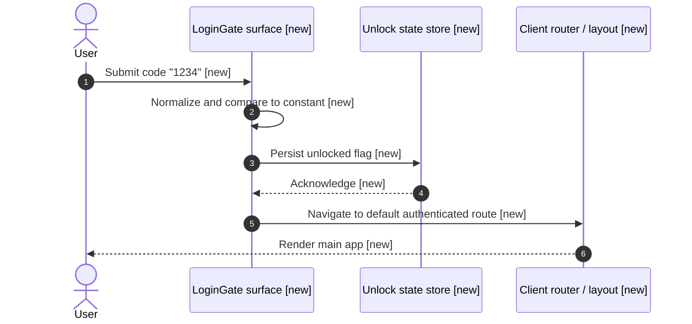

# Proposal: Dummy fixed-code login gate (PIN 1234)

> Add a minimal pre-app screen that accepts only a numeric/code field, treats `1234` as the sole valid credential for demo purposes, and blocks navigation to the rest of the product until the code is entered correctly.

## Problem Statement

### Current Behavior

- The workspace registers project `test` (GitHub repo `harshith-podifi/test`) per `workspace.yaml`. Pod workspace bootstrap now **provides** a verified primary git checkout at `projects/test/test__primary_worktree` (clone/sync via `pod-workspace-sync`); `pod-verify-primary-worktree --workspace workspace.yaml --project test` **passes**.
- `docs/workspace-context/*` is still **absent** in this workspace checkout, and `projects/test/docs/` exists as a directory but has **no** Architecture-as-Code files yet, so there is no checked-in routing/auth pattern doc to extend—only the greenfield `README.md` in the primary worktree.
- The primary worktree’s `README.md` states there is **no application code** yet (only placeholder artifacts), so there is **no** implemented login, router shell, or route-guard behavior to reuse; all gate flows are **net-new** implementation.

### Desired Behavior

- Present a simple **login gate** UI that prompts for a **single “code” field** (no username).
- Treat the literal value **`1234`** as the **only** accepted code (case and formatting as agreed in implementation—see open questions).
- After a **successful** check, allow the user to proceed to the normal app experience (dashboard, home, or existing default route).
- After a **failed** check, **do not** advance; keep the user on the gate with clear feedback that the code is wrong.

## Non-Functional Requirements

| Dimension | Target | Notes |
| :-------- | :----- | :---- |
| **Latency (p99)** | Not critical for MVP | Single client-side compare or one trivial round-trip if a stub API is used. |
| **Throughput** | N/A | Demo-grade; no scale target. |
| **Availability / SLA** | Best effort | No external dependency required for the baseline in-process check. |
| **Data sensitivity** | Low | Dummy credential; **not** a security boundary—suitable only for demos/dev. |
| **Auth model** | Pre-release gate only | No real identity, OAuth, or session issuance; optional lightweight “unlocked” flag only. |
| **Regulatory / compliance** | None assumed | Must not be mistaken for production authentication. |

## Architecture Impact

**Status:** requires updates to one or more project context docs

**Summary:** The workspace lists `test` as the sole project, but project Architecture-as-Code files (`projects/test/docs/*`) are not present yet in this checkout. Introducing a visible gate, route protection, and a documented dummy credential should be reflected in forthcoming `architecture.md` / `pattern.md` entries for the `test` repo once the application scaffold exists, so future work does not treat this as real auth.

**Context updates required:** Add or extend `projects/test/docs/architecture.md` and `projects/test/docs/pattern.md` (when created) to describe the demo gate, the session/unlock mechanism, and explicit warnings that `1234` is non-production.

**Drift or open questions:** Primary worktree **is** established and was read at the README level; no deeper source read was needed to confirm there is no competing login or router implementation. Project AoC under `projects/test/docs/` remains **unseeded** on disk, so framework and routing choices are still assumptions until a scaffold lands. **Deep-mode code baseline (approval review):** As of this revision, verified primary worktree content aligns with a **pure greenfield** app: no `LoginGate`, no route guard, and no client shell—consistent with sequence diagrams that label all app/runtime boundaries `[new]`. After implementation, reconcile labels and this section against real paths/routes (see Task 5).

**Approval / operational prerequisites (review remediation):** `row_id` preflight / `pod-proposal-review` §5 — primary worktree path `projects/test/test__primary_worktree` must exist and verify clean **before** an approval-mode review treats `VALIDATION_MODE` as `full`. This workspace now satisfies that prerequisite; maintainers should re-run `pod-workspace-sync` and `pod-verify-primary-worktree` on fresh clones.

## Out of Scope

- **Real authentication** (password hashing, MFA, identity providers, backend sessions).
- **Configurable secrets** via env or admin UI—the product owner intent is a **fixed** code `1234` for the dummy flow.
- **Rate limiting, account lockout, or audit logging** appropriate for production auth.
- **Multi-tenant or role-based access** after unlock.

## Solution

### Approach - Client-side gate with fixed PIN validation

**Proposed Solution:** Implement a **single “access code” screen** ahead of protected routes. On submit, compare the trimmed user input to the constant `1234`. If it matches, set a durable-enough **“unlocked”** indicator (implementation choice: in-memory for strictest demo simplicity, or `sessionStorage` so refresh within a tab does not re-prompt) and **redirect or render** the main app shell. If it does not match, **remain on the gate** and show a non-destructive error. All protected routes consult the same unlock signal before rendering.

**Architecture Flow:**

```text
User opens app -> LoginGate (code field) -> [validate == 1234] -> mark unlocked -> AppShell / main routes
                                       -> [validate != 1234] -> stay on LoginGate + error
```

**Sequence Diagrams:**

Status legend:

- `[existing]` - boundary or interaction reused as-is
- `[new]` - boundary or interaction introduced by this proposal
- `[changed]` - existing boundary or interaction whose behavior changes
- `[refactor]` - reorganized without intended behavior change
- `[delete]` - planned removal (not shown as active participant unless part of flow)
- `[unchanged]` - no intentional behavioral change

Overall data flow across the affected boundaries:

```mermaid
sequenceDiagram
    autonumber
    actor User as User
    participant Client as Client (host app) [new]
    participant Gate as LoginGate surface [new]
    participant Guard as Route or layout guard [new]
    participant App as Main app shell [new]

    User->>Client: Open application [new]
    Client->>Guard: Resolve initial navigation [new]
    Guard->>Gate: Not unlocked; show gate [new]
    User->>Gate: Enter code and submit [new]
    Gate->>Gate: Validate against fixed PIN [new]
    alt Code is 1234
        Gate->>Guard: Mark session unlocked [new]
        Guard->>App: Allow primary routes [new]
        App-->>User: Show main experience [new]
    else Code is not 1234
        Gate-->>User: Show error; remain on gate [new]
    end
```

Per-feature flow — **successful unlock**:



Per-feature flow — **failed attempt (blocked forward progress)**:

```mermaid
sequenceDiagram
    autonumber
    actor User as User
    participant Gate as LoginGate surface [new]
    participant Router as Client router / layout [new]

    User->>Gate: Submit wrong code [new]
    Gate->>Gate: Compare; mismatch [new]
    Gate-->>User: Inline error; do not set unlocked [new]
    Note over Gate,Router: Router never receives an unlock signal; deep links to protected routes still resolve to Gate [new]
```

**Implementation:**

- **Client / `test` repo:** Introduce `LoginGate` (or equivalent) as the entry route when locked; add a small unlock state module; wrap protected layouts with a guard that reads that state.
- **Constants:** Centralize the string `1234` in one module with a comment that it is **demo-only** and must not ship to production unchanged.
- **UX:** Single field, primary submit action, accessible error text for wrong code.

**Interaction verification mapping** (for manual / exploratory QA after build):

| Interaction | Visible outcome |
| :---------- | :-------------- |
| Open app while locked | User sees only the login gate; no main app chrome or protected content. |
| Submit wrong code | Inline error; user remains on gate; URL/navigation does not expose protected routes. |
| Submit `1234` | User advances to main app shell / default route; gate no longer blocks until unlock state clears (per chosen persistence). |
| Deep link to protected route while locked | Resolver redirects or substitutes gate; protected view does not render. |

**Pros:**

- **Minimal scope** aligned with “dummy login” intent.
- **No backend** required for the baseline.
- **Clear pass/fail** semantics for QA and demos.

**Cons:**

- **No real security**; anyone who knows `1234` bypasses the gate.
- Hard-coded credential complicates later hardening unless refactoring replaces this layer.

**Security & Operability:**

- **Security:** Document prominently as **non-production**. If a backend is added later, do not reuse this pattern for real auth.
- **Performance:** Trivial client-side branch.
- **Deployment / rollback:** Feature-flag optional if the team introduces real auth in parallel.
- **Observability:** Optional client log on failed attempts only if existing telemetry conventions allow PII-free counters.

**Effort:** Low

## Trade-off Summary

| Dimension | Assessment |
| :-------- | :--------- |
| **Security impact** | Negligible by design; must be labeled demo-only to avoid misuse. |
| **Performance (latency / throughput)** | No meaningful impact. |
| **Observability / monitoring** | Optional; not required for MVP. |
| **Deployment complexity** | Low—pure client change for baseline. |
| **Rollback strategy** | Revert gate component and route wiring. |
| **Failure mode** | Wrong code keeps user on gate; accidental lockout only if unlock state is lost (e.g., strict in-memory choice). |
| **Implementation effort** | Low. |
| **Operational complexity** | Low. |
| **Estimated cost** | None beyond normal dev time. |

## Technical Decisions

### Why a client-side fixed constant instead of a stub API?

- **Chosen because** the intent is a **dummy** gate with a **single known code**, fastest to build in a greenfield repo, and no server is required.
- **Alternative rejected because** an HTTP “login” endpoint adds operational and test overhead without improving the demo semantics.

### Why allow a lightweight unlock flag instead of full session cookies?

- **Chosen because** there is **no authenticated identity** to issue; the gate only expresses “user passed the demo PIN.”
- **Alternative rejected because** real session infrastructure is out of scope.

## Affected Systems

| System / Component | How affected |
| :----------------- | :----------- |
| `test` (GitHub application repo) | Primary checkout at `projects/test/test__primary_worktree`; all gate and router work is **new** against the current greenfield tree. |
| Pod workspace (`test-agentice-workspace`) | Proposal and future AoC under `projects/test/docs/`; workspace-level `docs/workspace-context/*` still absent. |

## Task Breakdown

1. **Task 1: Define unlock state and guard contract**  
   Intent: Specify how “unlocked” is represented and which routes are protected.  
   Outcome: Reviewers can trace every protected entry point to the same unlock check without ambiguity.  
   Dependencies: None

2. **Task 2: Implement LoginGate UI and fixed validation**  
   Intent: Build the single-field code screen and compare input to `1234` after normalization rules are chosen.  
   Outcome: Entering `1234` sets unlocked state; any other input shows an error and leaves the user on the gate.  
   Dependencies: Task 1

3. **Task 3: Wire router or layout so protected content stays unreachable when locked**  
   Intent: Ensure deep links cannot skip the gate while locked.  
   Outcome: Manual navigation tests confirm no forward progress to main app until the valid code is entered.  
   Dependencies: Task 2

4. **Task 4: Document demo limitations in project AoC**  
   Intent: When `projects/test/docs/` is seeded, record the dummy PIN pattern and non-production warning.  
   Outcome: New contributors see that `1234` is intentional demo behavior, not security.  
   Dependencies: Task 3

5. **Task 5: Reconcile diagrams and tasks with primary-worktree seams**  
   Intent: After Tasks 2–3 land in `projects/test/test__primary_worktree`, map each diagram boundary to real file paths, route names, or layout modules.  
   Outcome: A short mapping table (or inline bullets) ties LoginGate, guard, unlock store, and router shell to concrete repo locations; diagram `[new]`/`[changed]` labels are updated if any boundary reuses existing code.  
   Dependencies: Task 3

### Task Breakdown Summary

#### Dependency graph

```text
Task 1 -> Task 2 -> Task 3 -> Task 4
                      |
                      v
                    Task 5
```

#### Parallel execution waves

| Wave | Tasks | Gate before next wave |
| :--- | :---- | :-------------------- |
| **Wave 1** | Task 1 | Unlock model agreed |
| **Wave 2** | Task 2 | UI and validation compile |
| **Wave 3** | Task 3 | Routing verified manually |
| **Wave 4** | Task 4, Task 5 | AoC paths available; diagram reconciliation after code exists |

#### Critical path

`Task 1 -> Task 2 -> Task 3 -> Task 4`

(Task 5 branches from Task 3 and closes **CV1** / deep-mode alignment after implementation.)

#### Rationale

- **Task 1** - Prevents inconsistent duplicate checks across routes.
- **Task 2** - Delivers the user-visible acceptance criteria.
- **Task 3** - Satisfies “do not allow forward” for navigation edge cases.
- **Task 4** - Prevents architectural misunderstanding after approval.
- **Task 5** - Ensures proposal diagrams and checklist **SD3**/**TB9** claims remain true once code exists.

## Open Questions / Risks

- [x] **Primary worktree / approval preflight** — **Owner:** workspace maintainer — **Closed:** Checkout lives at `projects/test/test__primary_worktree`; run `pod-workspace-sync --workspace workspace.yaml --project test` on new machines, then confirm `pod-verify-primary-worktree` passes (remediates review **`row_id` preflight / `pod-proposal-review` §5** and unblocks **`row_id: CV1`** deep-mode reads).
- [ ] **Input normalization** — **Owner:** feature implementer (`test` repo) — **Assumption:** Leading/trailing whitespace is trimmed; no formatting mask required unless the scaffold UI library provides one by default.
- [ ] **Unlock persistence across browser refresh** — **Owner:** feature implementer (`test` repo) — **Assumption:** `sessionStorage` (or equivalent) is acceptable so demos are stable; stricter “always re-prompt on refresh” can be chosen if product prefers.
- [ ] **Stack-specific routing** — **Owner:** feature implementer (`test` repo) — **Assumption:** Whatever framework lands in `harshith-podifi/test` exposes a layout or router hook compatible with a guard component.
- [ ] **AoC doc gap** — **Owner:** workspace maintainers — **Assumption:** `projects/test/docs/*` will be seeded by `pod-project-context` or an equivalent initiative; directory exists today but has no markdown files yet.

## References

- `workspace.yaml`
- [`projects/test/test__primary_worktree/README.md`](../../projects/test/test__primary_worktree/README.md) (greenfield status of the application repo checkout)
- [harshith-podifi/test on GitHub](https://github.com/harshith-podifi/test) — upstream repository definition

## Glossary

| Term | Definition |
| :--- | :--------- |
| **Login gate** | A pre-app screen that blocks other routes until a condition (here, correct code) is met. |
| **Dummy login** | A non-production credential check used only for demos or scaffolding. |
