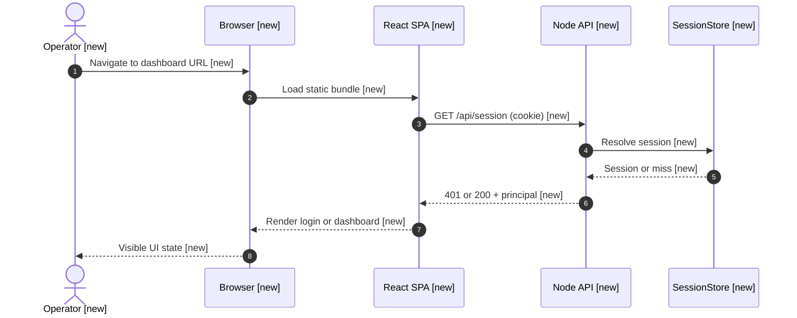
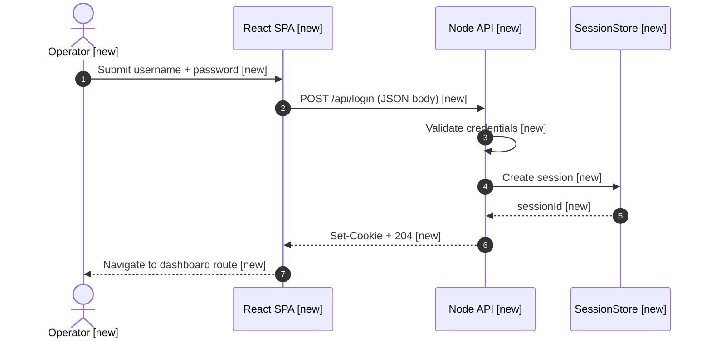
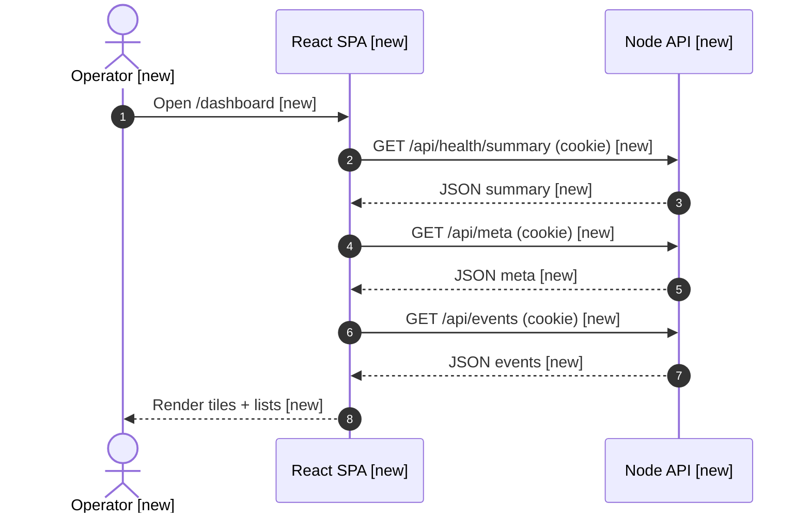
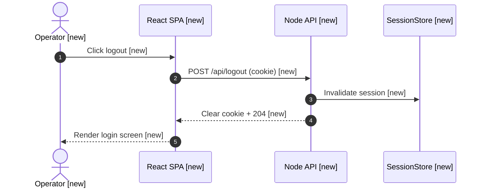

# Spec: Basic ops dashboard web app with session login

Deliver a minimal, production-leaning ops dashboard SPA gated by server-validated session login, implemented in the greenfield `test` GitHub repository (`harshith-podifi/test`), coordinated from this workspace spec.

## Context

The `test` application repository currently has no runtime code; workspace `projects/test/docs/` Architecture-as-Code paths referenced by the repo README are not present in-tree yet. This spec assumes a **dual-package layout at the repo root**: a small **Node.js HTTP API** that owns authentication and session issuance, and a **Vite + React + TypeScript** SPA that serves the login screen and post-login dashboard. All assumptions below replace a clarification round per developer instruction.

Working assumptions (also reflected under Open Questions):

- **Runtime:** Node.js 22 LTS; package manager **npm** with npm workspaces (`client`, `server`).
- **Auth model:** Single shared demo credential pair via environment variables (`OPS_DASHBOARD_USER`, `OPS_DASHBOARD_PASSWORD_HASH` or `OPS_DASHBOARD_PASSWORD` for bootstrap-only environments); production posture prefers bcrypt-verified hash.
- **Session transport:** HTTP-only, `Secure` (when TLS), `SameSite=Lax` session cookie pointing at opaque server-side session id stored in-memory for MVP (swap interface later for Redis).
- **Dashboard scope:** After login, show a read-only **Ops overview** page with three sections: (1) synthetic “service tiles” with OK/DEGRADED state loaded from `GET /api/health/summary`, (2) server build/version string from `GET /api/meta`, (3) placeholder “recent events” list from static fixture or `GET /api/events` returning canned JSON.
- **Tooling gap:** Workspace `required_cli_tools` lists `git`, `python`, `tree`, `rg` — verified present conceptually; **`pod-spec-id`, `pod-worktree-prepare`, and `pod-verify-spec-worktree` are not available in this authoring environment**. Spec id follows the documented slug-date contract manually; engineers must provision the spec-owned worktree with `pod-worktree-prepare` when CLI is available before execution.

---

## Sequence Diagrams

Status legend: `[new]` introduced by this work; `[existing]` reused unchanged (none yet in greenfield).

Overall data flow:



Login flow:



Authenticated dashboard data refresh:



Logout flow:



---

## Clarification record

None — no AskQuestion clarification round; developer required autonomous assumptions, recorded in Context, Constraints, and Open Questions.

---

## Assigned tasks

Execute in order; each task is independently reviewable.

| Task ID | Title | Primary owner (role) | Deliverable |
| --- | --- | --- | --- |
| `00-repo-tooling` | Monorepo scaffold + shared contracts | Platform / full-stack | Root workspace `package.json`, `client/` + `server/` packages, TypeScript configs, shared `packages/types` or root `shared/` types barrel |
| `01-api-auth-sessions` | Login, logout, session middleware | Backend | Express app with routes `/api/login`, `/api/logout`, `/api/session`, session cookie helpers, credential verify |
| `02-api-ops-read-models` | Ops summary endpoints | Backend | `/api/health/summary`, `/api/meta`, `/api/events` guarded by session middleware |
| `03-web-login-ui` | Login route + form | Frontend | React route `/login`, validation UX, error states, fetch wiring |
| `04-web-dashboard-ui` | Dashboard layout + data hooks | Frontend | `/dashboard` layout, tiles, loading/error empty states, TanStack Query or lightweight `useEffect` fetch pattern |
| `05-quality-bar` | Tests + verification scripts | QA / author | Unit tests for credential parser + session; component tests for login; supertest API tests; README runbook |

---

## Scope

### Packages / modules affected

- **Create** npm workspace roots: `client/` (Vite React SPA), `server/` (Express API), optional `packages/shared-types/`.
- **Modify** repository root `README.md` with local dev instructions (run API + web concurrently).

### Files to CREATE

- `package.json` (root workspaces definition)
- `client/package.json`, `client/vite.config.ts`, `client/tsconfig.json`, `client/index.html`
- `client/src/main.tsx`, `client/src/App.tsx`, `client/src/routes/*`, `client/src/pages/Login.tsx`, `client/src/pages/Dashboard.tsx`, `client/src/lib/api.ts`
- `server/package.json`, `server/tsconfig.json`, `server/src/index.ts`, `server/src/app.ts`, `server/src/routes/auth.ts`, `server/src/routes/ops.ts`, `server/src/middleware/requireSession.ts`, `server/src/session/memoryStore.ts`
- `server/src/auth/credentials.ts` (env-driven verifier)
- `.env.example` at repo root documenting required variables

### Files to MODIFY

- `README.md` — document ports (e.g., API `5050`, Vite `5173`), env vars, `npm install`, `npm run dev`.

### Files explicitly NOT to touch

- Workspace-only Pod skill directories under `.claude/` — spec authoring only; no unrelated workspace YAML edits.

### New dependencies

- **Server:** `express`, `cookie-parser`, `bcrypt` or `bcryptjs`, `zod`, `cors`, `helmet`, dev `typescript`, `tsx`, `vitest`, `supertest`
- **Client:** `react`, `react-dom`, `react-router-dom`, `@tanstack/react-query` (optional but preferred), `vite`, dev testing `@testing-library/react`, `vitest`, `jsdom`

---

## Execution Plan

### Step 1 — Task `00-repo-tooling`

Establish npm workspaces, shared TypeScript settings, root scripts `dev` (concurrently run client + server), `build`, `lint`, `test`. Add `.env.example`.

### Step 2 — Task `01-api-auth-sessions`

Implement Express bootstrap with security middleware (`helmet`, bounded `cors` allowing dev origin). Implement POST `/api/login` reading JSON `{ username, password }`, verifying against env-configured credentials, creating random session id, storing expiry (~8h sliding), setting cookie `ops_session`. Implement POST `/api/logout` clearing cookie + invalidating session. Implement GET `/api/session` returning `{ authenticated: boolean, user?: string }`.

### Step 3 — Task `02-api-ops-read-models`

Add `requireSession` middleware rejecting unauthenticated calls with `401` JSON `{ error: 'unauthorized' }`. Implement stub handlers returning deterministic JSON matching Data Shapes below.

### Step 4 — Task `03-web-login-ui`

Build `/login` with accessible form, inline errors for empty fields and failed login (show generic “Invalid credentials”). On success (204), navigate to `/dashboard`.

### Step 5 — Task `04-web-dashboard-ui`

Implement route guard: if `/api/session` reports unauthenticated, redirect `/login`. Dashboard fetch sequences with loading skeletons and graceful error banner.

### Step 6 — Task `05-quality-bar`

Add tests cited in Test Expectations; ensure CI-ready `npm test` at root delegating to workspaces.

---

## Data Shapes

```typescript
// Shared API contracts (authoritative for JSON bodies)
export type LoginRequest = { username: string; password: string };

export type SessionResponse =
  | { authenticated: false }
  | { authenticated: true; user: string };

export type HealthSummary = {
  generatedAt: string; // ISO-8601
  services: Array<{ id: string; name: string; status: 'OK' | 'DEGRADED' | 'DOWN'; detail?: string }>;
};

export type MetaResponse = { version: string; commit: string; environment: string };

export type OpsEvent = { id: string; ts: string; severity: 'info' | 'warning'; message: string };

export type EventsResponse = { items: OpsEvent[] };

export type ApiError = { error: string; code?: string };
```

---

## Interaction Parity Decisions

| User action | Expected visible outcome | Owner | Test reference |
| --- | --- | --- | --- |
| Submit valid credentials on `/login` | Redirect to `/dashboard`; sidebar/header shows operator identity string | `client/src/pages/Login.tsx` | Component + E2E stub |
| Submit invalid credentials | Inline alert; remain on `/login`; no cookie set | `client/src/pages/Login.tsx` | Component test |
| Load `/dashboard` unauthenticated | Immediate redirect to `/login` | router guard module | Router integration test |
| Click logout | Return to `/login`; subsequent `/api/*` calls unauthorized | `Dashboard` header control | API supertest + component |

---

## Test Expectations

### Unit / component

| # | Scenario | Expected outcome |
| --- | --- | --- |
| 1 | Credential helper with wrong password | Returns validation failure without throwing |
| 2 | Session store TTL | Expired session rejected |
| 3 | Login form empty submit | Disabled submit or validation messages |
| 4 | Dashboard tile rendering | Shows degraded count when summary includes DEGRADED |

### Integration / API

| # | Scenario | Expected outcome |
| --- | --- | --- |
| 1 | POST `/api/login` success | `Set-Cookie` present; `/api/session` authenticated |
| 2 | GET `/api/health/summary` without cookie | `401` |
| 3 | POST `/api/logout` | Cookie cleared; sessions invalidated |

---

## Constraints

- Cookies must be **HTTP-only**; never expose session tokens to JS globals.
- Do not log passwords or session secrets.
- Keep MVP dependency footprint small; avoid introducing a database until Redis substitution task is scheduled.
- Match workspace execution naming: branches derived from `worktree_name` `feat/basic-ops-dashboard-login` when using Pod worktrees.

---

## Non-Functional Considerations

### Security

- Auth impact: new credential gate for all `/api/*` except `/api/login` and static assets.
- Input validation: schema-validated JSON bodies with size limits.
- Secrets: only via environment variables; document rotation in README.
- Audit: optional structured logs on login success/failure without sensitive fields.

### Performance

- In-memory session store acceptable for MVP single-instance deploy.

### Quality

- Unified error JSON `{ error }` for API failures consumed by SPA.

### Production readiness

- Document TLS termination expectation for `Secure` cookies.
- Rollback: revert deploy; sessions ephemeral — users re-login.

---

## Patterns to Follow

Greenfield repository — no established internal patterns yet. Prefer idiomatic **Express** routing modules and **React function components** with hooks; centralize fetch + cookie handling in `client/src/lib/api.ts`.

---

## Verification

```bash
cd "$(git rev-parse --show-toplevel)"
npm install
npm run lint
npm run build
npm test
npm run dev # manual smoke: login, dashboard tiles, logout
```

Expected: ≥ 8 automated tests across ≥ 3 files (server unit + supertest + client component).

---

## Open Questions

Resolved assumptions (no blocking questions):

- [x] Stack locked to Node 22 + Express API + Vite React SPA npm workspaces.
- [x] Credential source is environment variables with bcrypt verification preferred.
- [x] Session persistence is in-memory for MVP with explicit follow-up for Redis.
