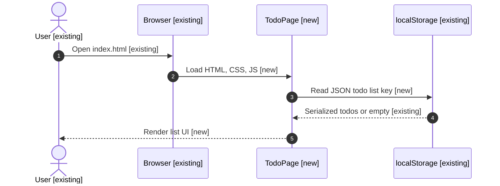
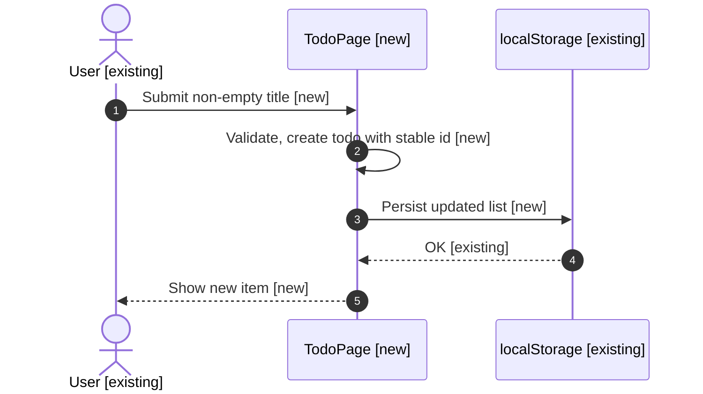
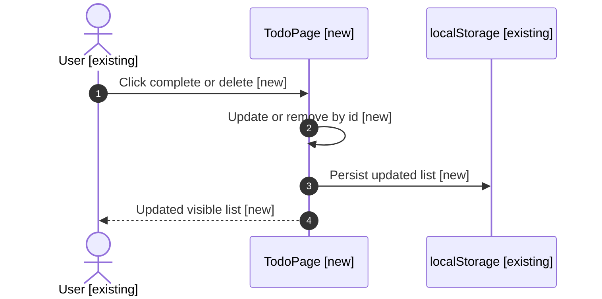
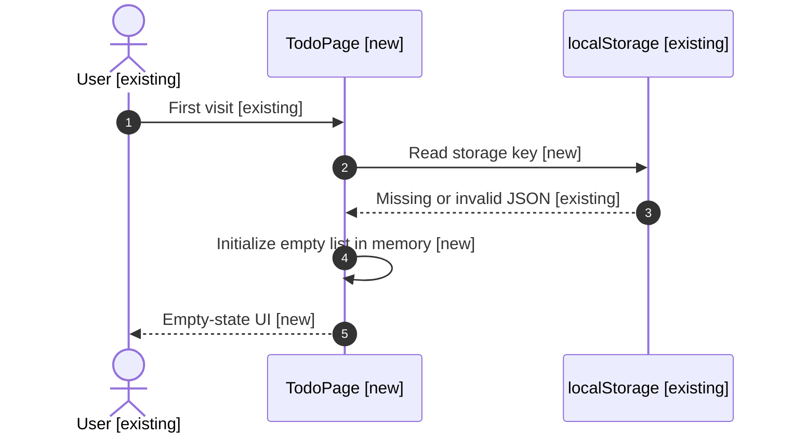

# Spec: Simple todo webpage

Deliver a single-page static todo list in the `test` project repository using HTML, CSS, and client-side JavaScript with `localStorage` persistence, assigned implementation tasks, and documented manual verification.

## Outcome

Users can add, complete, and delete todo items in the browser; the list survives reloads via `localStorage`, on a page reachable as static files from the repo root.

---

## Context

The `test` GitHub repository is a greenfield checkout with only `README.md`, `test.txt`, and Cursor metadata. No build tooling exists yet. This spec scopes a deliberately small, framework-free **todo webpage** so implementation can land entirely as static assets plus a short README update. Assumptions (no clarification round per intent): English UI copy, desktop-first responsive layout, no user accounts or backend, no third-party npm dependencies, and UTF-8 encoding throughout.

Architecture-as-Code project docs under `projects/test/docs/` are not present in this workspace snapshot; planning is grounded in `workspace.yaml`, the current repo tree, and the provisioned spec worktree after `pod-worktree-prepare`.

---

## Sequence Diagrams

Status legend:

- `[existing]` — reused as-is
- `[new]` — introduced by this spec
- `[changed]` — behavior changes
- `[unchanged]` — no intended behavior change

Overall data flow:



Flow — add todo:



Flow — toggle complete / delete:



Flow — first-time load (no saved data):



---

## Clarification record

None — no clarification round.

---

## Scope

### Packages / modules affected

- Repository root static assets only; no new packages.

### Files to CREATE

- `index.html` — document shell, accessible landmarks, form and list container.
- `styles.css` — layout, typography, completed-item styling, responsive rules.
- `app.js` — data model, `localStorage` read/write, DOM rendering, event handlers.

### Files to MODIFY

- `README.md` — add a **Usage** section: open `index.html` locally or via `python3 -m http.server`, mention persistence and browser support assumptions.

### Files explicitly NOT to touch

- `test.txt` — unrelated sample file; leave unchanged to avoid scope creep.
- `.cursor/**` — editor metadata, not product surface.

### New dependencies

None.

---

## Execution Plan

### Task A — Owner: implementer (data + storage contract)

Implement `app.js` to load and save an array of todos under a single namespaced storage key (for example `podifi.simple-todo.v1`). On missing or corrupt JSON, reset to an empty array without throwing. Each todo has a stable string `id`, `title`, `completed` boolean, and optional `createdAt` ISO string for stable ordering.

### Task B — Owner: implementer (UI + behavior)

Implement `index.html` and `styles.css` with: text input and add trigger; list of items with visible title; controls to mark complete/incomplete and delete; empty-state message when the list has no items. Completed items should be visually distinct (for example strikethrough or muted). Ensure focus and labels are usable with keyboard (native elements preferred).

### Task C — Owner: implementer (docs + polish)

Update `README.md` with run instructions and a one-line description of persistence. Run through **Verification** and fix any failures before handoff.

### Task D — Owner: reviewer

Confirm accessibility basics (semantic headings, form label association), confirm storage key and shape match **Data Shapes**, and confirm no network calls beyond loading static assets.

---

## Data Shapes

```typescript
/** Stored as JSON string under a single localStorage key. */
type TodoListV1 = TodoV1[];

interface TodoV1 {
  id: string;
  title: string;
  completed: boolean;
  createdAt?: string;
}
```

---

## Interaction Parity Decisions

| User action (CTA / trigger) | Expected visible outcome | Owner (route / component / system) | Test coverage reference |
| --------------------------- | ------------------------ | ---------------------------------- | ----------------------- |
| Submit non-empty todo title | Item appears in list, input clears | `index.html` form + `app.js` render | Integration table #1 |
| Submit empty or whitespace-only title | No new item, optional subtle feedback optional | `app.js` validation | Integration table #2 |
| Toggle completion | Item shows completed styling, state persists on reload | `app.js` + `styles.css` | Integration table #3 |
| Delete item | Item removed immediately, persists on reload | `app.js` | Integration table #4 |
| Hard reload browser | List matches last persisted state | `localStorage` + `app.js` | Integration table #5 |

---

## Test Expectations

### Unit tests / Component tests

| # | Scenario | Expected outcome |
| --- | -------- | ---------------- |
| 1 | N/A — no automated unit harness in repo yet | Manual verification per **Verification** |

### Integration tests / Page tests

| # | Scenario | Expected outcome |
| --- | -------- | ---------------- |
| 1 | Add "Buy milk" | Item visible with same title |
| 2 | Add with blank input | List length unchanged |
| 3 | Mark item complete, reload | Item still completed |
| 4 | Delete item, reload | Item stays absent |
| 5 | Corrupt storage value in devtools then reload | Page loads empty list without uncaught errors |

---

## Constraints

- Stack: static HTML/CSS/ES modules or classic script as implemented; no React/Vue build step unless a future spec introduces it.
- Persistence: `localStorage` only; no `cookie`, no remote API.
- Target project branch for merge: `main` on `https://github.com/harshith-podifi/test` per `workspace.yaml`.
- Workspace `required_cli_tools` lists `tree`, which was **not** available on the agent PATH during spec creation; use `find`/`ls` or install `tree` locally when following **Verification** literally is inconvenient (recorded as an explicit working assumption).

---

## Non-Functional Considerations

### Security

- Auth / authz impact: none (static client-only demo).
- Input validation: trim titles; reject empty adds; cap title length in implementation to a reasonable constant (for example 500 chars) to avoid oversized storage payloads.
- Secrets / PII: none.
- Audit logging: none.

### Performance

- Data access impact: single-key `localStorage` read per load and write on each mutation; acceptable for small lists.
- Caching: not applicable.
- Latency target: not specified (local-only).

### Quality

- Error handling: guard `JSON.parse`; log optional `console.error` only in development if desired; user-visible failure mode is safe empty state.
- Logging: none required.
- Coverage note: manual scenarios cover add, validate, complete, delete, reload, corrupt storage.

### Production Readiness

- Observability: none.
- Rollback plan: revert Git commit removing the new files and README edits.
- Breaking changes: none (new feature additive).

---

## Patterns to Follow

| What | Reference file |
| ----------------------- | -------------- |
| Repo intent / status | `README.md` (project root of `test`) |
| Workspace branch defaults | `workspace.yaml` (workspace root; `projects[].default_branch`) |

---

## Verification

Run from the `test` repository root (spec worktree checkout):

```bash
cd "$(git rev-parse --show-toplevel)"
test -f index.html && test -f styles.css && test -f app.js
rg -n "localStorage" app.js
python3 -m http.server 8765 --bind 127.0.0.1 >/tmp/todo-http.log 2>&1 & srv=$!; sleep 1
curl -sSf "http://127.0.0.1:8765/index.html" | head -n 5
kill $srv
```

Expected: HTTP 200 for `index.html`, storage usage confirmed in `app.js`, all three assets exist.

---

## Open Questions

- [ ] Install `tree` locally (listed in `workspace.yaml` `required_cli_tools`) so future spec steps can use it verbatim, or update workspace policy if `tree` is optional.
- [ ] Confirm whether marketing or product wants a specific storage namespace string instead of the suggested `podifi.simple-todo.v1` key.
