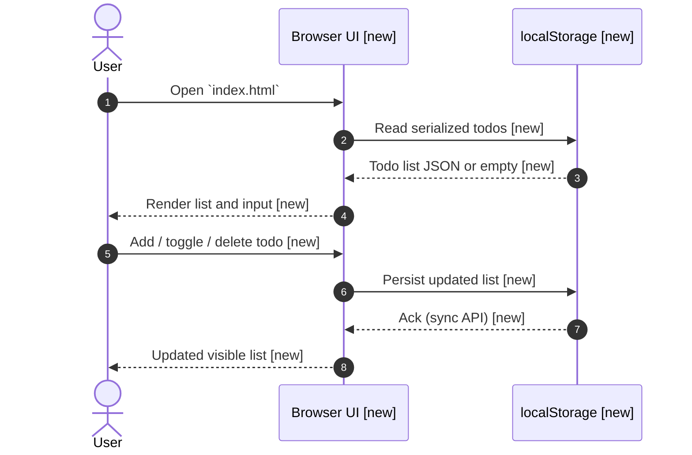
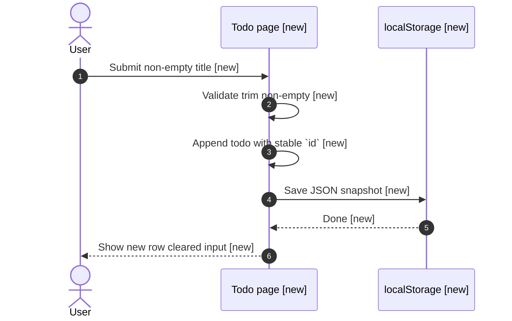
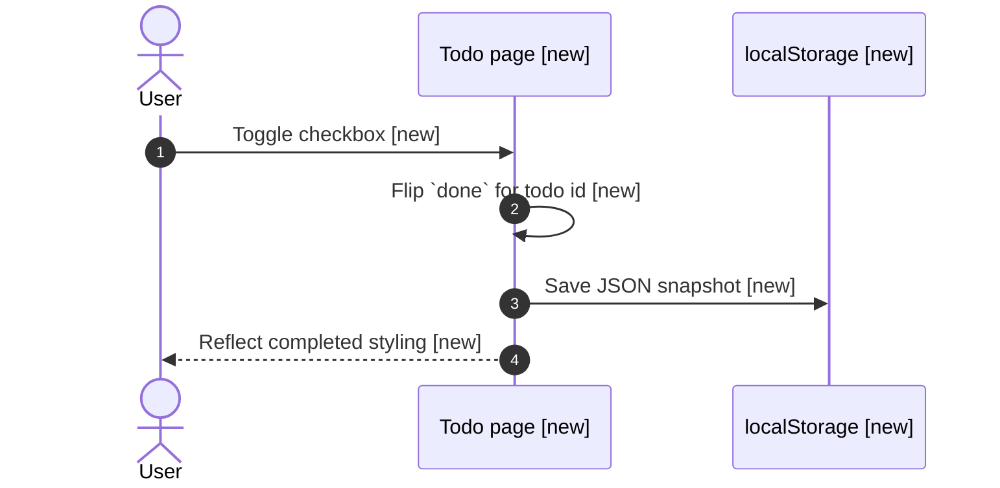
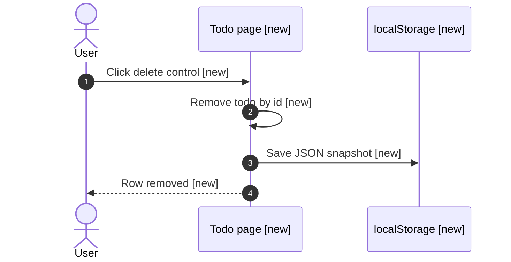

# Spec: Simple todo webpage

Ship a single-page static todo list in the `test` project worktree: users can add items, mark them complete, and remove them, with todos persisted in `localStorage` so a refresh keeps state.

## Context

The `test` repository is still a greenfield checkout (README and `test.txt` only). This spec adds a minimal browser-only UX with no build toolchain, matching the request for a simple webpage. All behavior runs in the client; there is no backend. Project Architecture-as-Code under `projects/test/docs/` is empty, so layering follows common static-site practice: one HTML entry file with scoped inline or embedded CSS and JS.

## Sequence Diagrams

Status legend:

- `[existing]` — reused as-is
- `[new]` — introduced by this spec
- `[unchanged]` — no behavior change

Overall data flow (static page + storage):



Flow — add todo:



Flow — toggle complete:



Flow — delete todo:



---

## Clarification record

None — no clarification round.

---

## Scope

### Packages / modules affected

- Static assets only in the `test` application repository (spec-owned worktree).

### Files to CREATE

- `index.html` — single-page todo UI (HTML structure, styles, and script for state and `localStorage`).

### Files to MODIFY

- None required for the minimal deliverable.

### Files explicitly NOT to touch

- `README.md` — product/docs scope for broader workspace; avoid unrelated doc churn unless a follow-up spec requires it.
- `test.txt` — unrelated placeholder.

### New dependencies

- None.

---

## Execution Plan

### Step 1 — Scaffold `index.html`

Create `index.html` at the repository root of the spec worktree with: page title, heading, text input, add button, and an empty list container; include accessible labels and keyboard focus order (input → add control).

### Step 2 — Client state and persistence

Implement in-page script: maintain an in-memory array of todos; on change serialize to JSON and write to `localStorage` under one fixed key (for example `todos.v1`); on load parse JSON, tolerate corrupt or missing data by resetting to an empty list, and re-render.

### Step 3 — Interactions

Wire add (trim, reject empty), toggle `done` via checkbox, and delete per row; re-render after each mutation so the DOM matches state; apply simple completed styling (for example strikethrough or muted text).

### Step 4 — Manual polish and smoke checks

Confirm refresh preserves todos; confirm empty list UX; smoke-test in a current evergreen browser.

---

## Data Shapes

```typescript
/** One todo row persisted in localStorage as part of an array */
interface TodoItem {
  id: string;
  text: string;
  done: boolean;
}
```

Storage contract:

- Key: single stable string constant in the page script.
- Value: JSON array of `TodoItem`.
- `id` generation: use `crypto.randomUUID()` when available, otherwise a short unique string fallback acceptable for this scope.

---

## Interaction Parity Decisions

| User action (CTA / trigger) | Expected visible outcome | Owner (route / component / system) | Test coverage reference |
| --------------------------- | ------------------------ | ----------------------------------- | ----------------------- |
| Enter text and add | New row appears; input clears | `index.html` inline script | Manual Scenario 1 |
| Toggle checkbox | Completed styling toggles | `index.html` inline script | Manual Scenario 2 |
| Click delete | Row disappears | `index.html` inline script | Manual Scenario 3 |
| Reload page | Prior todos still shown | `index.html` + `localStorage` | Manual Scenario 4 |

---

## Test Expectations

### Unit tests / Component tests

| # | Scenario | Expected outcome |
| --- | -------- | ---------------- |
| — | Not applicable | No automated test harness in repo yet; defer to manual verification per `Verification`. |

### Integration tests / Page tests

| # | Scenario | Expected outcome |
| --- | -------- | ---------------- |
| 1 | Add valid todo | Appears in list; persists after reload |
| 2 | Add whitespace-only | No row created |
| 3 | Toggle complete | Visual state and checkbox match `done` |
| 4 | Delete | Todo removed and stays removed after reload |
| 5 | Corrupt `localStorage` value | Page loads empty list without throwing |

---

## Constraints

- No npm/build pipeline unless a future spec introduces one; keep deliverable to static `index.html`.
- Do not add a backend or external API for this scope.
- Preserve existing unrelated files in the repo.

---

## Non-Functional Considerations

### Security

- Auth / authz impact: none (static file, local-only).
- Input validation: trim length; optional reasonable max length to avoid huge `localStorage` payloads.
- Secrets / PII: none.
- Audit logging: not applicable.

### Performance

- Data access impact: negligible (small JSON in `localStorage`).
- Caching: not applicable.
- Latency target: not specified.

### Quality

- Error handling: guard JSON parse; degrade to empty list.
- Logging: none for static page.
- Coverage note: manual scenarios above cover core flows.

### Production Readiness

- Observability: not applicable.
- Rollback plan: revert branch or delete `index.html`.
- Breaking changes: none (additive file).

---

## Patterns to Follow

| What | Reference file |
| ---- | -------------- |
| Repo status / greenfield note | `projects/test/test__primary_worktree/README.md` |

---

## Verification

```bash
# From the spec worktree root (same paths as clone root)
python3 -m http.server 8000
# Open http://localhost:8000/index.html in a browser and run manual scenarios.
```

Expected: all manual scenarios in **Integration tests / Page tests** pass in at least one current Chromium-based or Firefox browser.

---

## Open Questions

- [ ] Whether a later task should split CSS/JS into separate assets or introduce a bundler (deferred).
