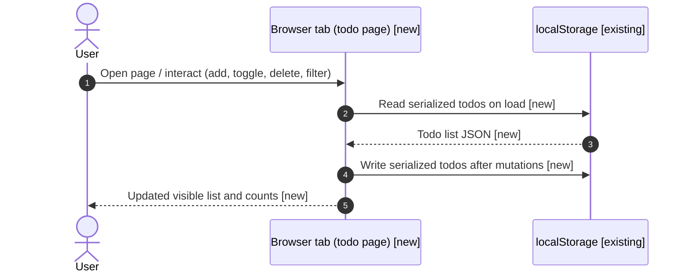
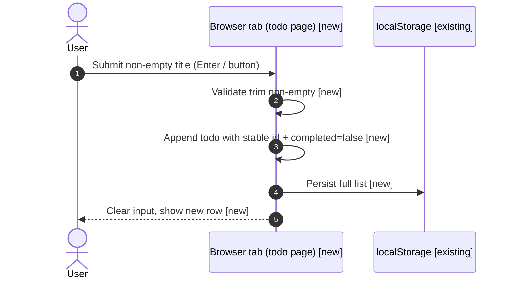
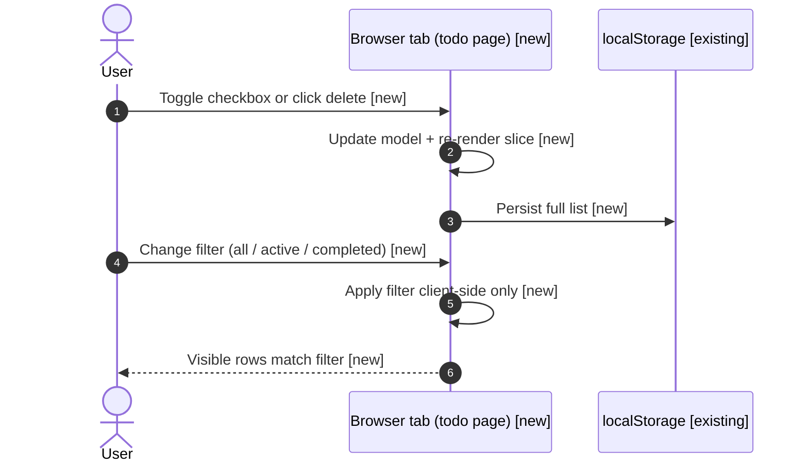

# Spec: Simple todo webpage (client-only)

> Deliver a single-page todo list in the `test` application repo with add,
> toggle-complete, delete, optional filter, and persistence via `localStorage`,
> verified by lightweight automated checks and manual smoke in a browser.

## Context

The `test` GitHub project is a greenfield repo with no application UI yet
(`README.md` describes upcoming breakdown-driven work). This spec scopes a
minimal, dependency-free static webpage so users can manage todos entirely in
the browser with durable local persistence. No backend or build toolchain is
introduced; assumptions are recorded here because clarification was waived.

Workspace `required_cli_tools` lists `python`; environments here expose `python3`
only—verification commands use `python3` explicitly (see `Constraints`).

---

## Sequence Diagrams

Status legend:

- `[existing]` — reused as-is
- `[new]` — introduced by this spec

Overall data flow:



Flow-specific: add todo



Flow-specific: toggle / delete / filter



---

## Clarification record

None — no clarification round.

---

## Scope

### Packages / modules affected

- None (static assets only in the `test` repo).

### Files to CREATE

- `index.html` — single-page todo UI, embedded or linked CSS/JS as decided in implementation (prefer one HTML entrypoint for simplicity).

### Files to MODIFY

- `README.md` — document how to open or serve the page locally (`python3 -m http.server`) and summarize behavior.

### Files explicitly NOT to touch

- `test.txt` — unrelated fixture/sample per existing repo layout; leave unchanged unless product owners retire it separately.

### New dependencies

- None (no `package.json`, no CDN requirement).

---

## Task assignments

Work is parallelizable after **Task 1** establishes file layout; default ownership is a single implementer executing in order.

| Task | Owner | Summary |
| ---- | ----- | ------- |
| **T1** | Implementing engineer | Create `index.html` shell: landmark regions, heading, form, list container, filter controls, footer hint for persistence. |
| **T2** | Implementing engineer | Implement todo model, DOM rendering, `localStorage` serialization (`JSON`), stable string ids (e.g. `crypto.randomUUID()` with fallback). |
| **T3** | Implementing engineer | Wire interactions: add (trim + reject empty), toggle complete, delete one, optional “clear completed”, filter All/Active/Completed, empty-state copy. |
| **T4** | Implementing engineer | Polish a11y basics: labels tied to inputs, keyboard usage for add, focus management after add when practical. |
| **T5** | Implementing engineer | Update `README.md` and run verification commands; fix issues found. |

---

## Execution Plan

### Step 1 — Entry page scaffold (**T1**)

Create `index.html` at the repository root with semantic structure for the todo
app (header, main form with text input and submit control, list element,
toolbar for filters). Include a linked stylesheet and script module **or**
inline CSS/JS blocks—keep total non-data code blocks in the spec under the
review policy; implementation chooses the smallest consistent structure.

### Step 2 — Model + persistence (**T2**)

Define the in-memory shape matching `Data Shapes`. On `DOMContentLoaded`, read
`localStorage` key `simple-todos-v1`; parse JSON; on failures treat as empty
array. After every mutation, write pretty-printed or compact JSON back to the
same key.

### Step 3 — Interactions and UX (**T3**)

Implement add, toggle, delete, filter, and optional clear-completed. Maintain a
live item count or subtle summary consistent with the visible filter. Ensure
completed styling is visually distinct (strikethrough or muted text).

### Step 4 — Accessibility pass (**T4**)

Associate `<label>` with the text input; ensure buttons have accessible names;
verify actions work without pointer-only affordances where feasible.

### Step 5 — Documentation + verification (**T5**)

Update `README.md` with usage instructions. Run checks from `Verification` and
record outcomes in the PR / execution notes.

---

## Data Shapes

```typescript
interface TodoItem {
  id: string;
  text: string;
  completed: boolean;
}

type TodoFilter = "all" | "active" | "completed";

const STORAGE_KEY = "simple-todos-v1";
```

---

## Interaction Parity Decisions

| User action | Expected visible outcome | Owner | Test coverage reference |
| ----------- | ------------------------ | ----- | ----------------------- |
| Enter text + submit | New row appears; input clears | `index.html` | Integration test row #1 |
| Toggle checkbox | Completed styling toggles; persists after reload | `index.html` | Integration test row #2 |
| Click delete | Row removes; persists after reload | `index.html` | Integration test row #3 |
| Switch filter | Only matching rows display | `index.html` | Integration test row #4 |
| Reload browser | Restored list matches last persisted state | `index.html` | Integration test row #5 |

---

## Test Expectations

### Unit tests / Component tests

| # | Scenario | Expected outcome |
| - | -------- | ---------------- |
| 1 | N/A for static page without harness | Document “no unit harness yet” in PR unless engineer adds minimal runner |

### Integration tests / Page tests

| # | Scenario | Expected outcome |
| - | -------- | ---------------- |
| 1 | Serve `index.html` via static server | Page responds HTTP 200 at `/` or `/index.html` |
| 2 | String checks on saved file | `index.html` contains todos container markup AND `localStorage` key literal `simple-todos-v1` |
| 3 | Manual smoke | Add two todos, complete one, filter Active / Completed, reload—state matches |

---

## Constraints

- No npm/yarn or bundler introduced unless workspace governance changes; stay static-file-only.
- Persistence must remain client-side (`localStorage`); no network writes.
- Target repo branch contract: implement inside the provisioned spec worktree
  `feat/simple-todo-webpage` rooted from `main`.
- Workspace `required_cli_tools` expects `python`; use `python3 -m http.server`
  for local verification when `python` is absent.

---

## Non-Functional Considerations

### Security

- Auth / authz impact: none (static page).
- Input validation: trim whitespace; ignore empty submissions; cap reasonable max length (e.g. 500 chars) to avoid oversized storage writes—document chosen cap in code comments only if enforced.
- Secrets / PII: none.
- Audit logging: not applicable.

### Performance

- Data access impact: trivial (`localStorage` only).
- Caching: not applicable.
- Latency target: instantaneous client-side UX.

### Quality

- Error handling: guard JSON parse; degrade to empty todos with optional console warning acceptable for MVP.
- Logging: none required beyond optional dev warnings.
- Coverage note: integration scenarios above cover persistence + interactions.

### Production Readiness

- Observability: none for static MVP.
- Rollback plan: revert single commit removing `index.html` changes.
- Breaking changes: none (additive files).

---

## Patterns to Follow

| What | Reference file |
| ---- | -------------- |
| Repo intent / greenfield status | `README.md` (project root of `test`) |

---

## Verification

```bash
# From provisioned worktree root (project test), after implementation:
python3 -m http.server 8765 &
curl -sf -o /dev/null http://127.0.0.1:8765/index.html
kill %1 2>/dev/null || true

# Static assertions (paths relative to repo root):
test -f index.html
rg -n "simple-todos-v1" index.html
rg -n "todo|Todo" index.html
```

Expected: `curl` succeeds; `rg` finds markers proving persistence key and UI vocabulary.

---

## Open Questions

- [ ] Whether to split CSS/JS into separate files versus single-file HTML—left to implementer for simplest reviewable diff.
