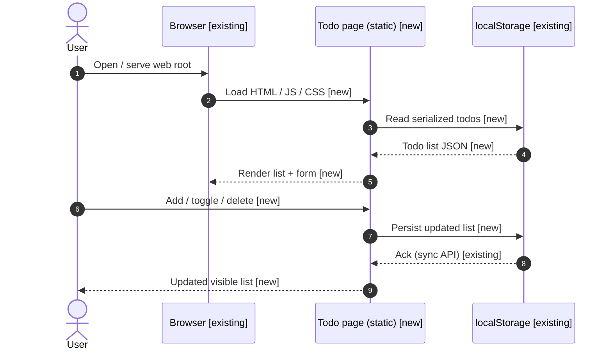
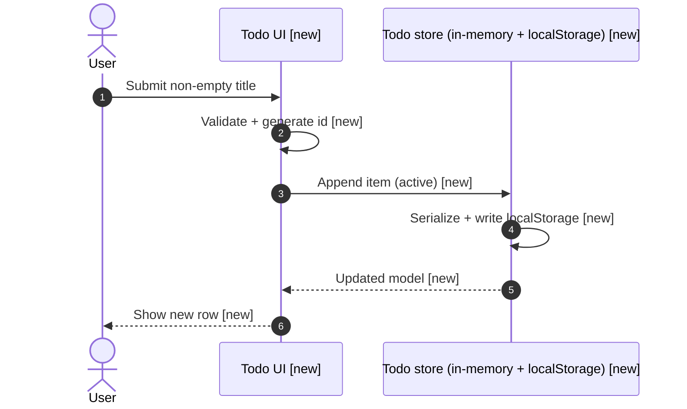

# Spec: Simple todo webpage

Ship a minimal, client-only todo interface in the `test` application repository as static assets that run in a browser without a build step.

## Outcome

Users can add, complete, and delete todo items in a single page; the list survives reloads via `localStorage` in the same browser and origin.

---

## Context

The `test` project repository is a greenfield checkout (see `README.md`) with no existing web application. Architecture-as-Code files referenced by that README (`projects/test/docs/` at workspace level) are not present in this workspace yet; this spec scopes a self-contained static front door that can land independently.

The implementation stays in the spec-owned worktree under `feat/simple-todo-webpage` and introduces a small `web/` directory so later tasks can add backends or bundlers without a disruptive move.

---

## Sequence Diagrams

Status legend:

- `[existing]` — unchanged boundary
- `[new]` — introduced by this spec
- `[changed]` — behavior change

Overall data flow:



Flow-specific: add todo



---

## Clarification record

None — no clarification round.

---

## Scope

### Packages / modules affected

- Static `web/` assets only inside the `test` git repository (spec worktree).

### Files to CREATE

- `web/index.html` — document shell, todo form, list container, load scripts/styles.
- `web/styles.css` — minimal layout, readable typography, completed-item styling.
- `web/app.js` — todo state, DOM rendering, `localStorage` persistence (`todo-app` key or similar).

### Files to MODIFY

- `README.md` — add a short "Web todo" section: how to open the page (direct file vs `python -m http.server` from `web/`).

### New dependencies

None.

---

## Execution Plan

### Step 1 — Scaffold static web entry

Create `web/index.html` with semantic structure: heading, text input, add button, list element, and script/style references. No framework.

### Step 2 — Todo model and persistence

In `web/app.js`, define the in-memory list, load from `localStorage` on startup, and save after every mutation. Use a single JSON key. Handle corrupt JSON by resetting to an empty list and logging to `console`.

### Step 3 — UI behaviors

Render the list from the model. Support: add (non-empty trim), mark complete/incomplete (checkbox or toggle), delete row. Reflect completed state visually (e.g. strikethrough + muted color via CSS).

### Step 4 — Polish and docs

Add `web/styles.css` for spacing and focus states. Update `README.md` with local run instructions aligned with `Verification`.

---

## Data Shapes

```typescript
type TodoId = string;

interface Todo {
  id: TodoId;
  title: string;
  completed: boolean;
  createdAt: string; // ISO-8601
}

type TodoStorageV1 = {
  version: 1;
  todos: Todo[];
};
```

---

## Interaction Parity Decisions

| User action (CTA / trigger) | Expected visible outcome | Owner (route / component / system) | Test coverage reference |
| --------------------------- | ------------------------ | ---------------------------------- | ----------------------- |
| Enter text + Add | New row appears with title, default active | `web/app.js` + `web/index.html` | Page manual / integration row 1 |
| Toggle complete | Row shows completed styling; state persists on reload | `web/app.js` | Page manual / integration row 2 |
| Delete | Row disappears immediately; stays gone after reload | `web/app.js` | Page manual / integration row 3 |
| Reload page | List matches last saved state | `localStorage` + load path | Page manual / integration row 4 |

---

## Test Expectations

### Unit tests / Component tests

| # | Scenario | Expected outcome |
| --- | -------- | ---------------- |
| 1 | N/A | No unit harness in repo today; defer to manual verification below. |

### Integration tests / Page tests

| # | Scenario | Expected outcome |
| --- | -------- | ---------------- |
| 1 | Serve `web/` and open `index.html` | Form and empty list render |
| 2 | Add two items | Both visible in order |
| 3 | Complete one item | Styling toggles; survives reload |
| 4 | Delete one item | Removed; survives reload |

---

## Constraints

- No backend, no npm dependency, no framework — plain HTML/CSS/JS only.
- Persist with `localStorage` only; no cross-browser sync.
- All changes occur in the provisioned worktree branch `feat/simple-todo-webpage` for project `test`.

---

## Non-Functional Considerations

### Security

- Auth / authz: none (static demo scope).
- Input validation: trim titles; refuse empty adds; cap title length in code (e.g. 200 chars) to limit storage abuse.
- Secrets / PII: none.
- Audit logging: not applicable.

### Performance

- Small client-side list; linear render acceptable for typical demo-scale lists.

### Quality

- Corrupt storage: reset to empty list, `console.warn` once.
- Keyboard: Enter in input submits add when non-empty.

### Production Readiness

- Observability: none for static demo.
- Rollback: revert branch or delete `web/` + README hunk.
- Breaking changes: none (new surface area).

---

## Patterns to Follow

| What | Reference file |
| ---- | ---------------- |
| Repo layout / status | `README.md` |

---

## Verification

```bash
cd "projects/test/test__worktrees/feat/simple-todo-webpage"
python3 -m http.server --directory web 8765 --bind 127.0.0.1
# In another terminal:
curl -sSf "http://127.0.0.1:8765/" | head -n 5
```

Stop the server after the smoke check. Complete the interaction checks in **Integration tests** using a browser pointed at `http://127.0.0.1:8765/`.

Expected: manual integration checks only until a test harness exists in the repo.

---

## Open Questions

- [ ] Whether future tasks should migrate the static page into a bundled SPA (Vue/React) or keep static assets alongside an API — defer until backend spec exists.
